# MementoFrame Installation Guide

Set up MementoFrame on Raspberry Pi OS Lite using the automatic installer, then finish the setup from the frame's web dashboard.

## Quick Start

| Step | What to do |
|---:|---|
| **1** | [Prepare the microSD card](#prepare-the-sd-card) and enable SSH in Raspberry Pi Imager. |
| **2** | Start the Pi, connect through SSH, and run the [automatic installer](#automatic-installation-recommended). |
| **3** | Let the Raspberry Pi reboot, then open the [configuration dashboard](#post-install-configuration). |
| **4** | Configure WeatherAPI, optional Spotify integration, Wi-Fi, display settings, and photos. |

> **Recommended path:** use the automatic installer. The [manual installation](#manual-installation-advanced) and [technical reference](#automatic-installation-options-and-technical-reference) are available later in this guide.

---

## Prepare the SD Card

Use [Raspberry Pi Imager](https://www.raspberrypi.com/software/) to install Raspberry Pi OS and prepare the Pi for a headless setup—without connecting a keyboard, mouse, or separate monitor.

1. Insert the microSD card into your computer and open Raspberry Pi Imager.
2. Under **Device**, select **Raspberry Pi 3** for the tested Raspberry Pi 3B+.
3. Under **OS**, select **Raspberry Pi OS (other)**, then choose **Raspberry Pi OS Lite (64-bit)** or **Raspberry Pi OS Lite (32-bit)**.
4. Select the microSD card under **Storage**.
5. Open **Customisation**, complete the settings below, and write the card.

<table>
  <tr>
    <td align="center">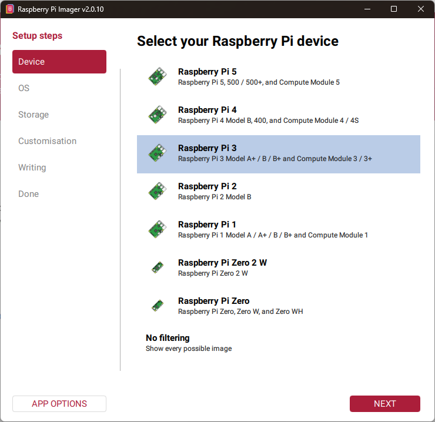<br/><strong>1. Select the device</strong></td>
    <td align="center">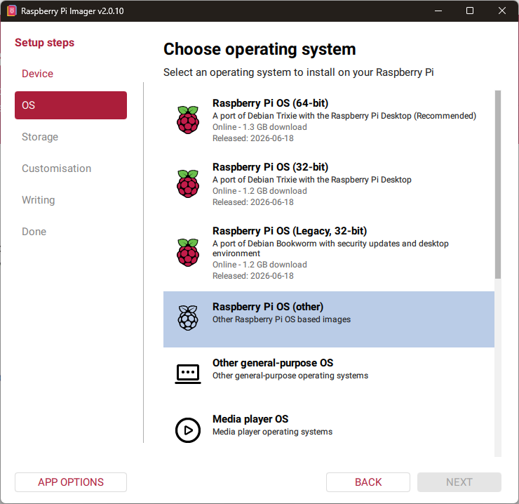<br/><strong>2. Open other OS options</strong></td>
    <td align="center">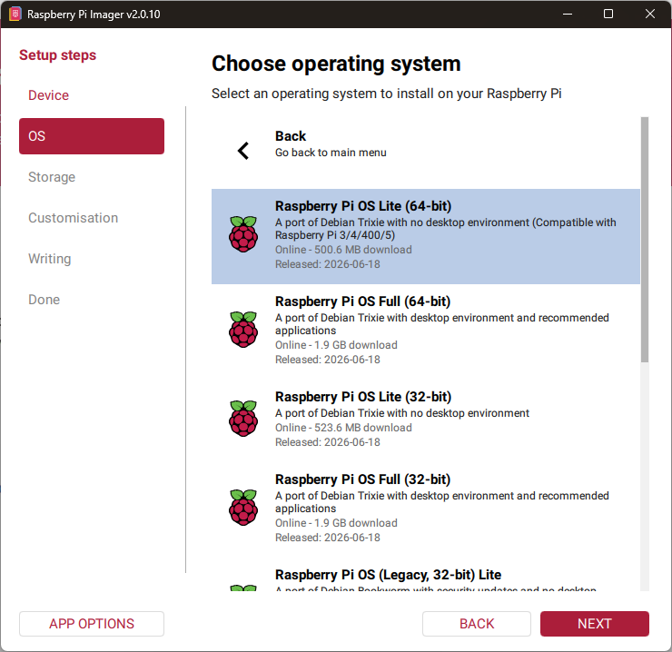<br/><strong>3. Select Raspberry Pi OS Lite</strong></td>
  </tr>
</table>

### Imager Customisation

Raspberry Pi Imager can configure the following before the Pi's first boot:

| Setting | Recommendation |
|---|---|
| **Hostname** | Use `mementoframe` to make the Pi available as `mementoframe.local`. A different hostname also works, but use `<your-hostname>.local` when connecting. |
| **Username and password** | Create the account that you will use to sign in and run the installer. |
| **Wi-Fi** | Enter the network name, password, and country if the frame should join Wi-Fi on its first boot. You can also leave this unset and configure Wi-Fi later through MementoFrame AP mode. |
| **Locale and timezone** | Select the values appropriate for the frame's location. |
| **SSH** | **Enable SSH.** Use password authentication or add an SSH public key. |

SSH is required for a peripheral-free installation. After writing the card, insert it into the Pi, power it on, wait for it to join the network, and connect from another computer:

```bash
ssh <username>@mementoframe.local
```

Replace `<username>` with the account created in Raspberry Pi Imager. If you selected another hostname, replace `mementoframe.local` as well. Once connected, run the automatic installation commands in the next section.

### 32-bit and 64-bit Trixie

MementoFrame supports Raspberry Pi OS Lite Trixie in both **32-bit** and **64-bit** versions.

- **64-bit Trixie** can use the full KMS graphics driver.
- **32-bit Trixie** uses the FKMS compatibility driver for this display setup.

Full KMS display behavior is still being tested. Two frames with slightly different revisions of the same display controller PCB produced different results, so FKMS may remain the safer option if the display is blank or unstable.

---

## Automatic Installation (Recommended)

On a fresh Raspberry Pi OS Lite installation, open a terminal and run:

```bash
cd ~
curl -fL https://github.com/MrBroccoliJP/MementoFrame/releases/latest/download/install.sh -o install.sh
sudo bash install.sh
```

This downloads the latest stable MementoFrame release, prepares the Raspberry Pi, and installs the required software. The Pi reboots automatically when the installation finishes.

> **Next:** after the frame restarts, continue with [Post-Install Configuration](#post-install-configuration).

Need a different release, repository, or development checkout? See [Automatic Installation Options and Technical Reference](#automatic-installation-options-and-technical-reference). If the installer cannot complete, use the [manual installation](#manual-installation-advanced).

---

## Post-Install Configuration

After the Pi reboots, open the MementoFrame configuration dashboard using the address that matches the frame's connection:

| Connection | Dashboard address |
|---|---|
| Connected to the frame's `MementoFrame` setup hotspot | `http://192.168.4.1:5000` |
| Frame already connected to your Wi-Fi | `http://mementoframe.local:5000` or `http://<frame-ip>:5000` |

The network address is available immediately only when Wi-Fi credentials were added through Raspberry Pi Imager or the frame has connected previously. Otherwise, begin with the setup hotspot.

### Finding and Opening the Dashboard

The configuration QR code is normally shown in the system area of the frame's display. It always points to the dashboard at the frame's current IP address and port `5000`. Scan it with a phone connected to the same network as the frame.

The Wi-Fi indicator beside the QR code shows which connection is ready:

| Indicator | Meaning | What to do |
|---|---|---|
| **Green** | The frame is connected to a Wi-Fi network and has internet access. | Connect your phone or computer to that same network, then scan the updated QR code. |
| **Blue** | The frame is in **AP (Access Point) mode**. The frame has created its own local Wi-Fi network because it is not connected to another network. | Connect your phone or computer to the open Wi-Fi network named `MementoFrame`, then scan the QR code or open `http://192.168.4.1:5000`. The dashboard PIN protects the configuration page even though the setup network is open. |

#### Access During Night Mode

The dashboard QR code is always shown while the display is on, except when the scheduled night mode has powered the display off. If the screen is off:

1. Power the display off and on to wake it temporarily. It should remain visible for approximately one minute, allowing the network state and QR code to update.
2. Wait for the Wi-Fi indicator to become **green** for a normal Wi-Fi connection or **blue** for AP mode.
3. Scan the QR code only after the indicator and QR address have updated.

#### Dashboard Security PIN

Opening the configuration dashboard from a new browser or device requires a six-digit PIN. The PIN-entry page causes the frame's display to wake so the code can be read, including during night mode. If the screen does not wake or the PIN does not appear, refresh the PIN-entry page and check the display again. Note: The display takes a few seconds to power on.

The PIN-entry page and the matching code on the frame look like this:

<table>
  <tr>
    <td align="center">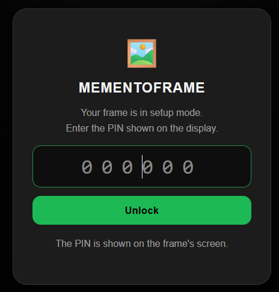<br/><strong>Browser PIN request</strong></td>
    <td align="center">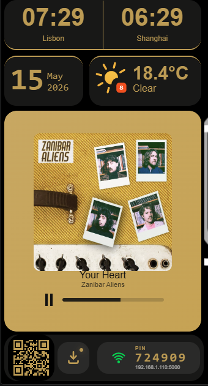<br/><strong>PIN shown on the frame</strong></td>
  </tr>
</table>

Enter the displayed PIN and select **Unlock**. The PIN is temporary and expires after 10 minutes. It disappears from the frame after a successful unlock. Each browser or device has its own locked session; when another browser needs access after the previous PIN was used or expired, MementoFrame generates a new PIN. This prevents a code observed earlier from providing permanent dashboard access.

Configure the integrations in this order: **WeatherAPI key**, **Spotify app credentials**, and then the **Spotify user connection**. Spotify is optional; all other dashboard settings can be configured independently.

This guide uses two kinds of configuration pages:

| Page | Where it runs | Purpose |
|---|---|---|
| **External service dashboard** | A public website such as WeatherAPI.com or Spotify for Developers | Create accounts, API keys, app credentials, redirect URIs, and permitted Spotify users. |
| **MementoFrame dashboard** | On the Raspberry Pi at port `5000` | Give the frame the credentials created by the external services and configure its local behavior. |

The external dashboards do not configure the frame directly. You first create or configure a value on the external website, then copy that value into the MementoFrame dashboard.

### 1. WeatherAPI

The weather setup begins on the external WeatherAPI website and finishes on the frame:

```text
WeatherAPI.com account → API key and response fields → MementoFrame dashboard
```

#### External: WeatherAPI Website

1. Create an account at [WeatherAPI.com](https://www.weatherapi.com/).
2. Open the WeatherAPI dashboard and copy your API key. Keep this browser tab available; the key will be pasted into MementoFrame later.
3. Still in the WeatherAPI dashboard, open **API > API Response Fields** and select the fields listed below. Leaving unused fields disabled reduces the response size while preserving everything MementoFrame displays.

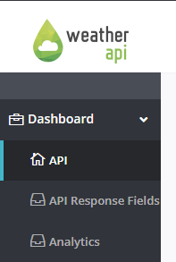

Select these response fields:

| Group | Fields |
|---|---|
| Current Weather | `last_updated`, `temp_c`, `is_day`, `text`, `icon`, `code`, `wind_kph`, `precip_mm`, `humidity`, `feelslike_c`, `uv`, `heatindex_c`, `dewpoint_c` |
| Forecast Day | `date` |
| Forecast Day > Day | `maxtemp_c`, `mintemp_c`, `avgtemp_c`, `totalprecip_mm`, `avghumidity`, `text`, `icon`, `code`, `uv`, `avgwetbulb_c`, `avgwetbulb_f`, `maxwetbulb_c`, `maxwetbulb_f` |
| Forecast Day > Astro | `sunrise`, `sunset`, `moon_phase`, `is_sun_up` |
| Forecast Day > Hour | `time`, `temp_c`, `is_day`, `text`, `icon`, `code`, `wind_kph`, `precip_mm`, `humidity`, `feelslike_c`, `heatindex_c`, `dewpoint_c`, `chance_of_rain`, `uv`, `wetbulb_c`, `wetbulb_f` |

#### Internal: MementoFrame Dashboard

Return to the local MementoFrame dashboard at port `5000`. Under **Weather Configuration**:

1. Paste the API key copied from WeatherAPI.com into **WeatherAPI.com Key**.
2. Enter the weather location as `City,Country`, for example `Aveiro,Portugal`.
3. Select **Save Weather Settings**.

The API key comes from WeatherAPI.com, but the location is configured on MementoFrame itself.

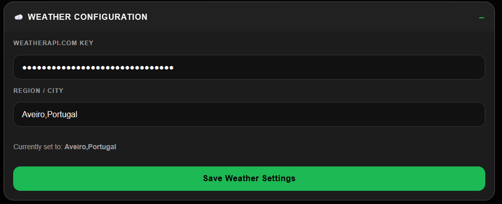

### 2. Spotify App Credentials (Optional)

Spotify playback data requires your own Spotify developer app. This setup also begins on an external website and finishes on the frame:

```text
Spotify Developer Dashboard → Client ID, secret, redirect URI, and users → MementoFrame dashboard
```

#### External: Spotify Developer Dashboard

Create an app in the [Spotify Developer Dashboard](https://developer.spotify.com/dashboard), then open its settings and configure the values shown below.

| Spotify app setting | Value |
|---|---|
| App name | `MementoFrame` (or another name of your choice) |
| App description | `MementoFrame` |
| Redirect URI | `https://httpbin.org/anything` |
| Additional redirect URI shown in the example | `http://127.0.0.1:8080/callback` |
| APIs used | Web API and Web Playback SDK |

The HTTPBin redirect URI is required for the dashboard connection flow. Copy it exactly, including `https://` and `/anything`.

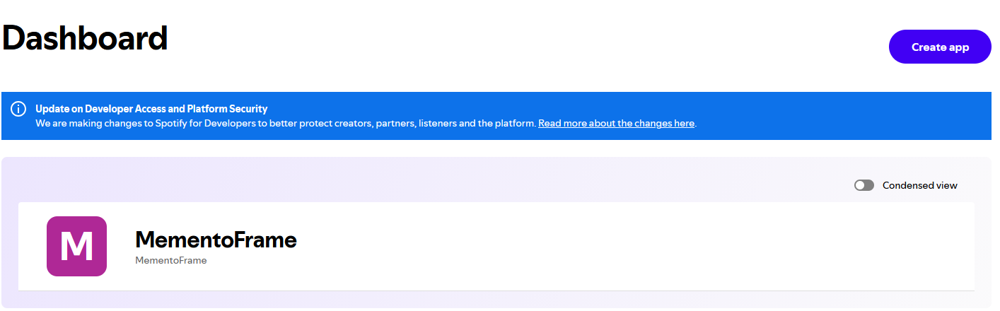

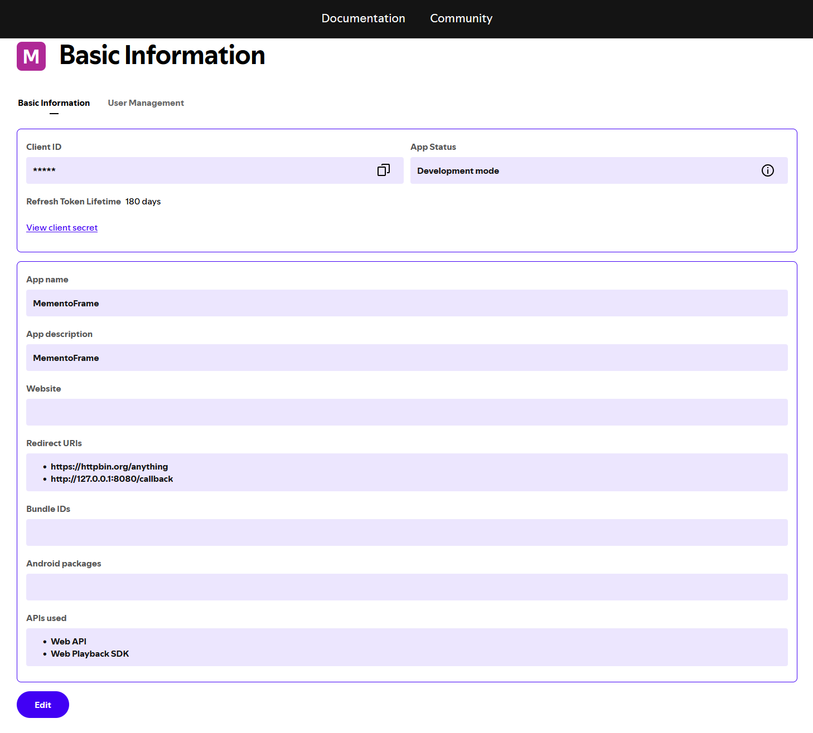

> **Spotify development-mode requirement (2026):** every Spotify account that will connect to MementoFrame must first be explicitly added to the developer app's user allowlist. In February 2026 Spotify changed Development Mode to require a Premium account for the app owner and limit each app to five authorized users. Previously, development apps allowed broader user access. See Spotify's [Development Mode documentation](https://developer.spotify.com/documentation/web-api/concepts/quota-modes) and [February 2026 announcement](https://developer.spotify.com/blog/2026-02-06-update-on-developer-access-and-platform-security).

While still on the external Spotify dashboard, open the app's **User Management** tab. Add each intended user with the full name and email address associated with that user's Spotify account. An unregistered user may appear to sign in, but Spotify will reject that user's API requests.

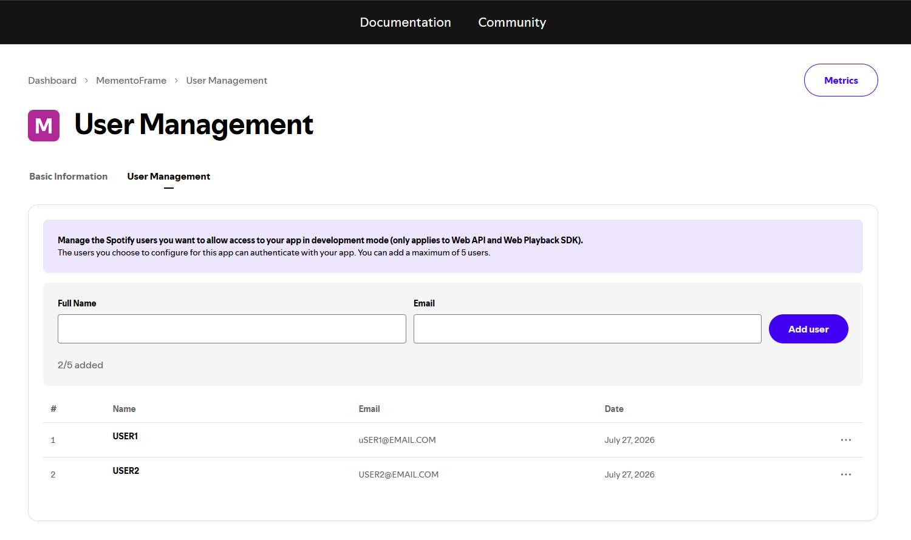

Before leaving Spotify's dashboard, copy the app's **Client ID** and reveal and copy its **Client Secret**. Treat the secret like a password.

#### Internal: MementoFrame Dashboard

Return to the local MementoFrame dashboard at port `5000`. Under **Spotify App Settings**:

1. Paste the **Client ID** copied from Spotify.
2. Paste the **Client Secret** copied from Spotify.
3. Enter `https://httpbin.org/anything` as the **Redirect URI**.
4. Select **Save Spotify App Settings**.

The status will say that the credentials are saved but the account is not connected. This is expected until the user authorization in the next section is completed.

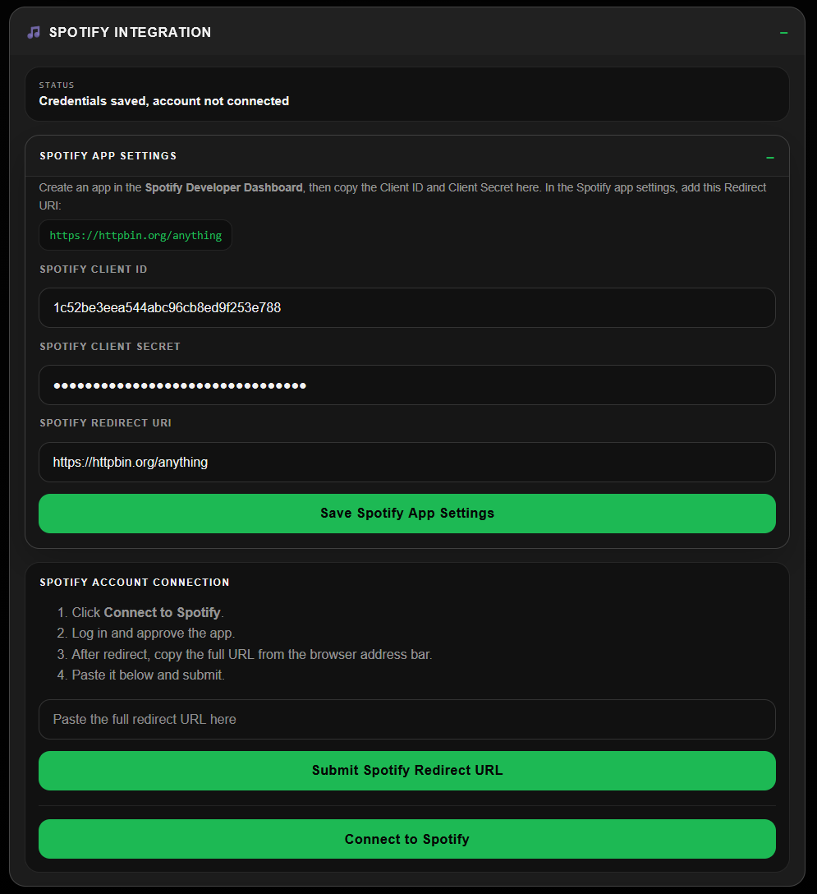

### 3. Connect a Spotify User (Optional)

This stage moves between the internal dashboard, Spotify, HTTPBin, and back to the internal dashboard:

```text
MementoFrame dashboard → Spotify authorization → HTTPBin redirect → MementoFrame dashboard
```

After saving the app credentials and allowlisting the user:

1. **MementoFrame dashboard:** select **Connect to Spotify**.
2. **External Spotify page:** sign in with an allowlisted Spotify account and approve access.
3. **External HTTPBin page:** after Spotify redirects the browser, copy the **entire URL from the browser address bar**, including the `?code=...` query string. Nothing needs to be entered on the HTTPBin page itself.
4. **Return to the MementoFrame dashboard:** switch back to its existing browser tab, use the browser's **Back** button, or open the dashboard again at `http://mementoframe.local:5000` or `http://192.168.4.1:5000` while connected to the setup hotspot. Do not paste the URL into HTTPBin or Spotify.
5. If you returned with the browser's **Back** button, refresh the MementoFrame dashboard before continuing. This ensures the page is ready to receive the authorization response.
6. **MementoFrame dashboard:** paste the copied HTTPBin URL into **Paste full redirect URL here**, then select **Submit Spotify Redirect URL**. The internal dashboard should show **Connected as _user_**.

The authorization code is temporary and can only be used once, so submit the copied URL promptly. If it expires or fails, start again with **Connect to Spotify**.

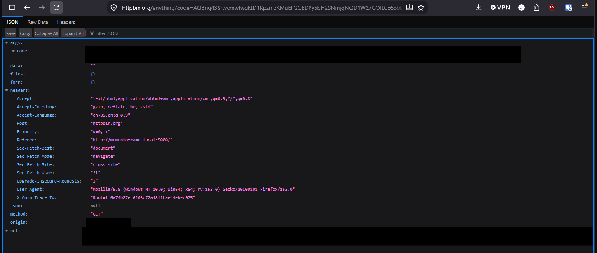

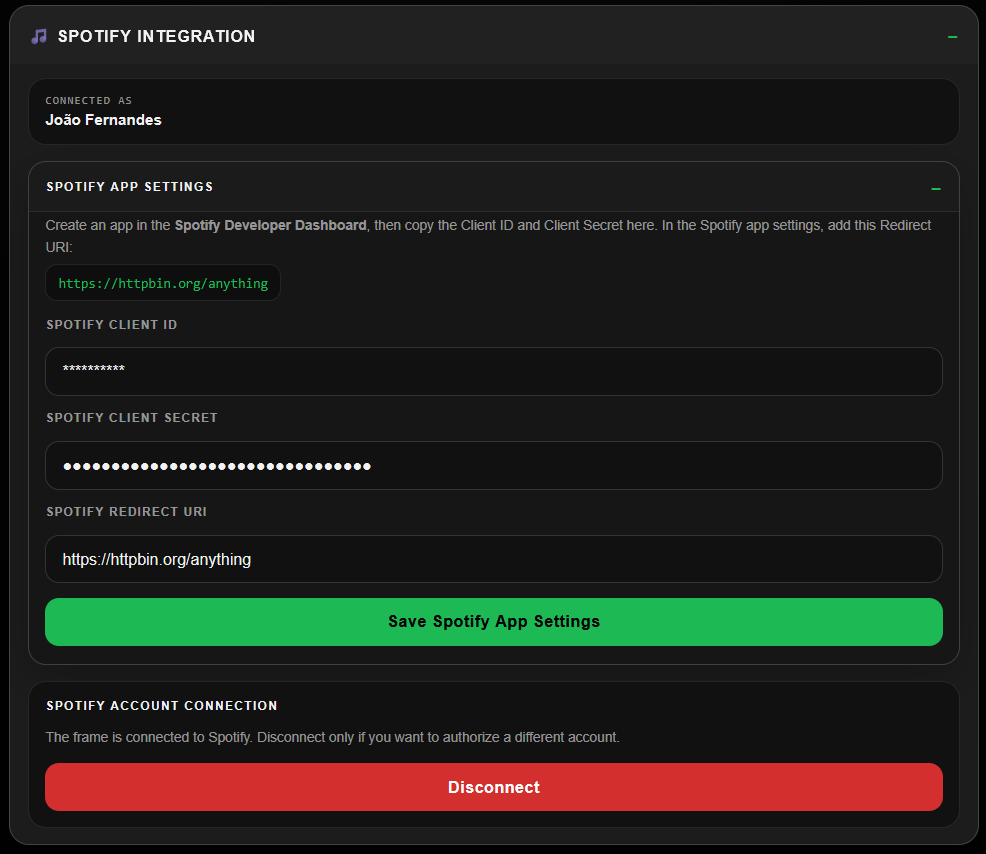

### 4. Remaining Internal Dashboard Settings

The following settings exist only in the MementoFrame dashboard; they do not require another external service dashboard. Once the integrations are working, configure them to suit the installation.

#### Wi-Fi and Frame Controls

Choose a network, enter its password, and select **Connect**. The controls at the top of the page can reload the display, restart the frame, or turn the screen on.

> **After selecting Connect:** the dashboard will stop responding or refreshing when the frame leaves AP mode and receives a new IP address. This is expected. Connect your phone or computer to the selected Wi-Fi network, wait for the frame's Wi-Fi indicator to turn **green**, and then scan the updated QR code on the display to reopen the dashboard at its new address. If the indicator remains **blue**, the connection was not completed and the frame is still in AP mode; reconnect your device to the `MementoFrame` Wi-Fi network and use `http://192.168.4.1:5000`.

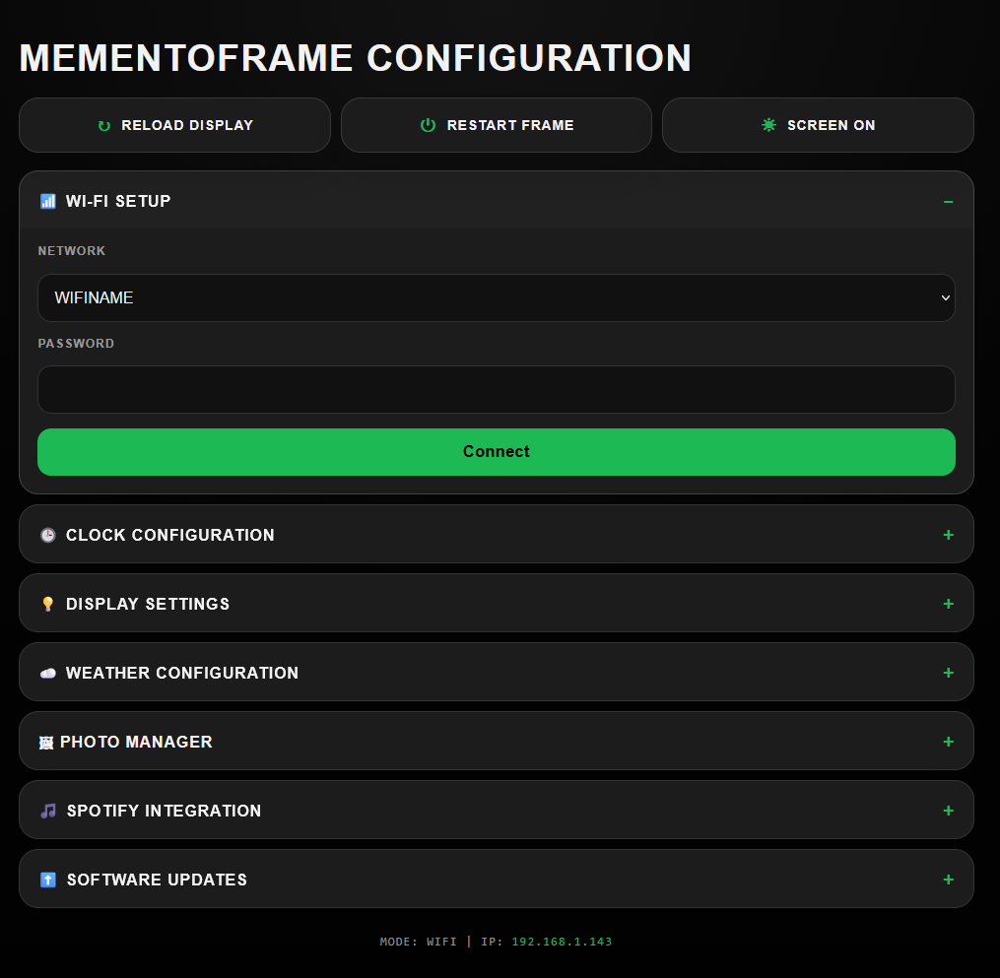

#### Clocks

Set the primary clock's timezone and label. A second clock can be enabled with a separate timezone and label.

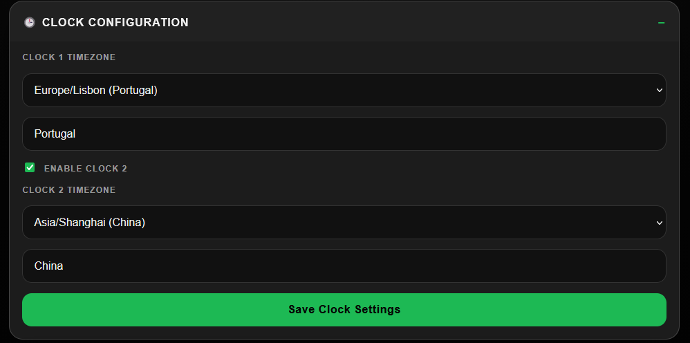

#### Display and Power Schedule

Set the display brightness and optionally enable an automatic off/on schedule. Save the schedule after changing its times.

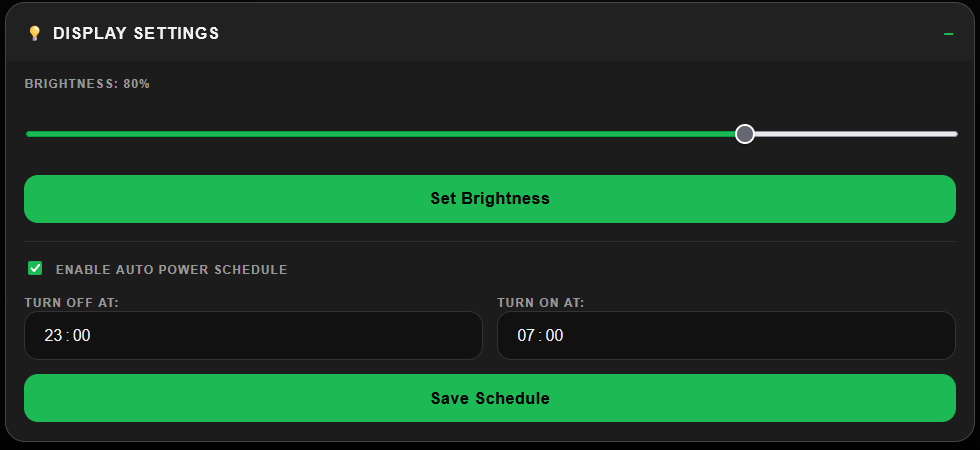

#### Photos

Upload the photos shown by the frame, monitor upload progress, and select existing photos for deletion.

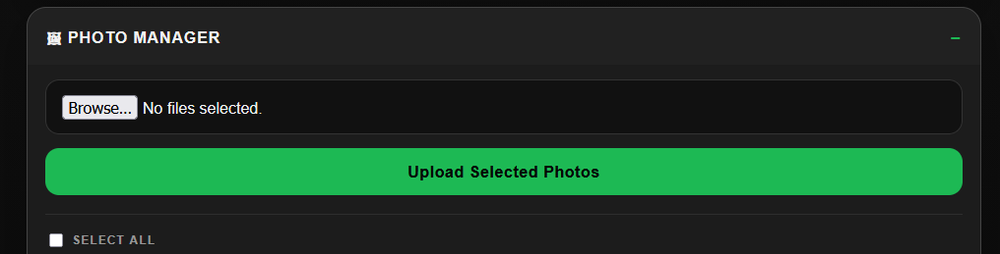

#### Updates

Choose the update repository and stable or pre-release channel, enable or disable automatic updates, check for a newer release, and install it from the dashboard.

When **Automatically install updates** is enabled, MementoFrame checks for updates hourly but only installs an available update during a one-hour installation window:

- If the automatic display power schedule is enabled, the window begins at the configured **screen-on time**. For example, an on time of `07:00` permits installation between `07:00` and `07:59`.
- If the automatic display power schedule is disabled, the default installation window is `07:00`–`07:59` in the Raspberry Pi's local time.

After successfully installing an automatic update, MementoFrame requests a reboot so the new version can start. The dashboard's **Install Update Now** action does not wait for this scheduled window.

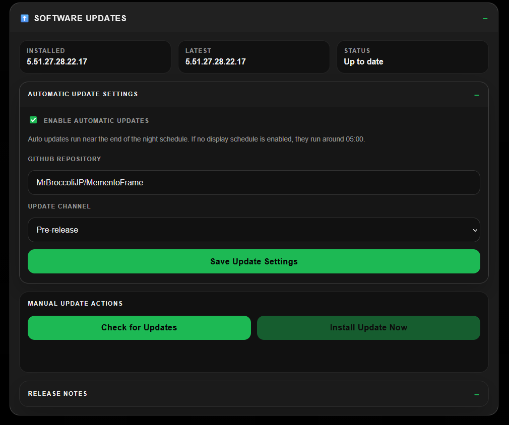

### Advanced `.env` Configuration

The installer runs `updater.py install`, which creates `.env` if it is missing. The dashboard is the recommended place to save WeatherAPI and Spotify settings, but administrators can edit the environment file directly:

```bash
sudo -u mementoframe nano /home/mementoframe/mementoframe/.env
```

```env
SPOTIFY_CLIENT_ID=
SPOTIFY_CLIENT_SECRET=
SPOTIFY_REDIRECT_URI=https://httpbin.org/anything
GITHUB_TOKEN=
MEMENTOFRAME_UPDATE_REPO=MrBroccoliJP/MementoFrame
```

Private GitHub repository updates require `GITHUB_TOKEN`. Never commit `.env` or share the Spotify client secret or WeatherAPI key.

---

## Automatic Installation Options and Technical Reference

This section documents optional installer controls and the system changes made by the recommended installation. Most users do not need these details.

### Tested Hardware

| Component | Tested configuration |
|---|---|
| Raspberry Pi | Raspberry Pi 3B+ |
| Operating system | Raspberry Pi OS Lite 13 (Trixie), 32-bit and 64-bit |
| Python | Raspberry Pi OS system Python, tested with Python 3.13 |
| Display | GeekPi 7-inch HDMI display, 1024×600 |

### Software and Services Used

- NetworkManager and `nmcli` for Wi-Fi and AP mode
- Flask services for the configuration dashboard and display API
- Chromium in kiosk mode
- GPIO controls for display power and brightness
- I²C and the Raspberry Pi RTC overlay for the DS3231 clock
- `updater.py` for installation and GitHub Release updates
- Separate systemd services for the configuration, display, network, kiosk, updater, and post-reboot checks
- Pillow and system WebP libraries for photos and thumbnails

### Installer Options

Install a specific release tag:

```bash
sudo INSTALL_TAG=v1.25.22.21.21.13 bash install.sh
```

Install the newest non-draft pre-release or release instead of only the latest stable release:

```bash
sudo INSTALL_CHANNEL=pre-release bash install.sh
```

Skip the final reboot while developing or testing installer changes:

```bash
sudo SKIP_REBOOT=1 bash install.sh
```

Install from a fork or another repository:

```bash
sudo INSTALL_REPO=owner/repository bash install.sh
```

Use a local checkout instead of downloading a release:

```bash
sudo SRC_DIR="$(pwd)" bash install.sh
```

`SRC_DIR` must point to the repository root containing the inner `mementoframe/` application folder. This override is intended for development.

### What the Installer Does

`install.sh`:

1. Requires root/sudo and creates the `mementoframe` user when needed.
2. Adds the user to the required `video`, `input`, `gpio`, and `netdev` hardware groups.
3. Stops an earlier MementoFrame installation before changing network settings.
4. Installs Chromium, NetworkManager, X/Openbox, GPIO, WebP, RTC, and Python dependencies.
5. Enables NetworkManager, handles conflicting `dhcpcd`, unblocks Wi-Fi, and enables its radio.
6. Configures HDMI, quiet boot, X permissions, GPIO screen enable, and the DS3231 RTC.
7. Downloads the selected GitHub Release to `/home/mementoframe/mementoframe` and runs `updater.py install`.
8. Enables automatic updates using the selected repository and release channel.
9. Creates the kiosk launcher, split systemd services, and limited sudo permissions.
10. Enables the services and reboots unless `SKIP_REBOOT=1` is set.

### Runtime Files

| File | Purpose |
|---|---|
| `config_portal_service.py` | Configuration dashboard on port `5000`. |
| `display_service.py` | Local display/frontend API on port `5001`. |
| `network_manager_service.py` | NetworkManager Wi-Fi/AP fallback watchdog. |
| `updater.py` | Installation, update, and post-reboot helper. |
| `version_info.py` | Release and component version metadata. |
| `requirements.txt` | Python dependencies. |
| `config.json` | User configuration. |
| `.env` | Local secrets and optional GitHub token. |
| `resources/userdata/` | Persistent photos, thumbnails, cache, and generated files. |
| `runtime/` | Runtime state, including update state and temporary PIN data. |

### Directories

| Path | Purpose |
|---|---|
| `/home/mementoframe/mementoframe` | Runtime application root. |
| `/tmp/mementoframe-install-src` | Temporary extracted release source. |
| `/home/mementoframe/mementoframe/resources/userdata` | Persistent user data preserved during updates. |
| `/home/mementoframe/mementoframe/runtime` | Runtime state preserved during updates. |
| `/home/mementoframe/mementoframe/.env` | Local secrets preserved during updates. |
| `/home/mementoframe/mementoframe_backups` | Update backups. |

### Boot Display Configuration

The installer creates timestamped backups before editing the existing configuration:

```text
/boot/firmware/config.txt.mementoframe.bak.YYYYMMDD-HHMMSS
/boot/firmware/cmdline.txt.mementoframe.bak.YYYYMMDD-HHMMSS
/etc/X11/Xwrapper.config.mementoframe.bak.YYYYMMDD-HHMMSS
```

It preserves unrelated Raspberry Pi settings and ensures `dtoverlay=vc4-fkms-v3d` exists globally. Under `[all]`, it configures the DS3231 RTC, tested 1024×600 HDMI display, and GPIO screen-enable pin:

```ini
[all]
dtparam=i2c_arm=on
dtoverlay=i2c-rtc,ds3231
enable_uart=1
disable_splash=1
avoid_warnings=1
gpu_mem=185
gpio=26=op,dh
hdmi_force_hotplug=1
hdmi_group=2
hdmi_mode=87
hdmi_cvt=1024 600 60 6 0 0 0
config_hdmi_boost=7
```

The DS3231 normally becomes `/dev/rtc0` after reboot. `util-linux-extra` supplies the `hwclock` userspace utility.

The installer keeps `/boot/firmware/cmdline.txt` on one line and ensures these quiet-boot values:

```text
console=tty3 quiet splash loglevel=1 logo.nologo vt.global_cursor_default=0 consoleblank=0
```

It preserves `fsck.repair=yes`, does not add the less-safe `fsck.mode=skip`, writes the following X wrapper configuration, and masks the tty1 login prompt:

```ini
allowed_users=anybody
needs_root_rights=yes
```

```bash
systemctl disable --now getty@tty1.service
systemctl mask getty@tty1.service
```

---

## Manual Installation (Advanced)

Use this path when the automatic installer cannot complete or when you need to perform and diagnose each stage yourself. The automatic and manual methods are alternatives; do not run both for a normal installation.

Install the operating-system dependencies and create the dedicated runtime user:

```bash
sudo apt update
sudo apt install -y \
  python3 python3-pip python3-venv git \
  network-manager wireless-tools iw iproute2 rfkill curl ca-certificates \
  chromium unclutter xserver-xorg xinit openbox x11-xserver-utils \
  libjpeg-dev zlib1g-dev libwebp-dev webp util-linux-extra python3-rpi.gpio

sudo adduser --disabled-password --gecos "MementoFrame" mementoframe || true
sudo usermod -aG video,input,gpio,netdev mementoframe
```

Copy the repository's inner `mementoframe/` directory to the runtime location, then initialize it:

```bash
sudo mkdir -p /home/mementoframe/mementoframe
sudo cp -a /path/to/release-or-checkout/mementoframe/. /home/mementoframe/mementoframe/
sudo chown -R mementoframe:mementoframe /home/mementoframe/mementoframe

cd /home/mementoframe/mementoframe
sudo -u mementoframe python3 updater.py install
```

Replace `/path/to/release-or-checkout` with the extracted release or checkout root. The source must contain the inner `mementoframe/` application folder.

Complete the same system integration performed by `install.sh`:

1. Apply the settings in [Boot Display Configuration](#boot-display-configuration), preserving unrelated Raspberry Pi settings.
2. Configure NetworkManager and disable conflicting `dhcpcd` management if it is present.
3. Create the five units listed under [Services](#services).
4. Add the limited permissions described in [Update/Reboot/Wi-Fi Permissions](#updaterebootwi-fi-permissions).
5. Enable the services and reboot.

For the RTC, ensure these directives are present under `[all]` in `/boot/firmware/config.txt`:

```ini
[all]
dtparam=i2c_arm=on
dtoverlay=i2c-rtc,ds3231
```

After rebooting, confirm that Raspberry Pi OS created the RTC device:

```bash
ls -l /dev/rtc*
sudo hwclock --show
```

If the automatic installer failed only because packages were missing, install the dependencies above and rerun `sudo bash install.sh` instead of continuing with the fully manual path.

---

## Services

### `mementoframe-config.service`

Runs the admin/configuration portal.

```text
/etc/systemd/system/mementoframe-config.service
```

Important values:

```ini
User=mementoframe
WorkingDirectory=/home/mementoframe/mementoframe
ExecStart=/home/mementoframe/mementoframe/venv/bin/python3 /home/mementoframe/mementoframe/config_portal_service.py
```

Port:

```text
5000
```

### `mementoframe-display.service`

Runs the local display/frontend API.

```text
/etc/systemd/system/mementoframe-display.service
```

Important values:

```ini
User=mementoframe
WorkingDirectory=/home/mementoframe/mementoframe
ExecStart=/home/mementoframe/mementoframe/venv/bin/python3 /home/mementoframe/mementoframe/display_service.py
```

Port:

```text
5001
```

### `mementoframe-network.service`

Runs the NetworkManager Wi-Fi/AP fallback watchdog.

```text
/etc/systemd/system/mementoframe-network.service
```

Important values:

```ini
User=root
WorkingDirectory=/home/mementoframe/mementoframe
ExecStart=/home/mementoframe/mementoframe/venv/bin/python3 /home/mementoframe/mementoframe/network_manager_service.py
```

This service runs as root so the existing NetworkManager commands can manage AP/client mode reliably.

### `mementoframe-kiosk.service`

Runs Chromium in kiosk mode.

```text
/etc/systemd/system/mementoframe-kiosk.service
```

Important values:

```ini
User=mementoframe
Environment=DISPLAY=:0
ExecStart=/usr/bin/startx /usr/local/bin/mementoframe-kiosk.sh -- :0
After=mementoframe-display.service
Requires=mementoframe-display.service
```

The kiosk launcher disables X screen saver/DPMS every time X starts. This prevents HDMI from going to “No Signal” after the default 10-minute X timeout. It also hides the cursor with `unclutter`, sets the X root background black, stores Chromium cache in `/dev/shm`, and uses GPU/compositing flags for smoother image fades.

### `mementoframe-post-reboot.service`

Runs the update lifecycle health check after boot.

```text
/etc/systemd/system/mementoframe-post-reboot.service
```

It polls:

```text
http://127.0.0.1:5000/health
http://127.0.0.1:5001/health
```

and clears `pending_restart` in `runtime/update_state.json` once both services respond.

---

## Service Commands

Restart everything:

```bash
sudo systemctl restart mementoframe-network.service
sudo systemctl restart mementoframe-config.service
sudo systemctl restart mementoframe-display.service
sudo systemctl restart mementoframe-kiosk.service
```

Check status:

```bash
systemctl status mementoframe-config.service
systemctl status mementoframe-display.service
systemctl status mementoframe-network.service
systemctl status mementoframe-kiosk.service
systemctl status mementoframe-post-reboot.service
```

Useful logs:

```bash
journalctl -u mementoframe-config.service -f
journalctl -u mementoframe-display.service -f
journalctl -u mementoframe-network.service -f
journalctl -u mementoframe-kiosk.service -f
```

---

## Update/Reboot/Wi-Fi Permissions

The installer creates:

```text
/etc/sudoers.d/mementoframe-updater
```

With limited permissions for the app user:

```sudoers
mementoframe ALL=(root) NOPASSWD: \
  /usr/bin/systemctl restart mementoframe-config.service, \
  /usr/bin/systemctl restart mementoframe-display.service, \
  /usr/bin/systemctl restart mementoframe-network.service, \
  /usr/bin/systemctl restart mementoframe-kiosk.service, \
  /usr/bin/systemctl stop hostapd, \
  /usr/bin/systemctl stop dnsmasq, \
  /usr/bin/nmcli, \
  /usr/sbin/reboot, \
  /sbin/reboot, \
  /usr/bin/reboot
```

The `mementoframe` user is not granted unrestricted root access.

---

## Verify Install

```bash
curl http://127.0.0.1:5000/health
curl http://127.0.0.1:5001/health
curl http://127.0.0.1:5000/versions
curl http://127.0.0.1:5001/versions
```

Then check services:

```bash
systemctl status mementoframe-config.service
systemctl status mementoframe-display.service
systemctl status mementoframe-network.service
systemctl status mementoframe-kiosk.service
```

Check Wi-Fi radio state:

```bash
nmcli radio wifi
nmcli device status
```

After the kiosk starts, verify X screen blanking is disabled:

```bash
DISPLAY=:0 xset q
```

Expected values include `timeout: 0` under Screen Saver and `DPMS is Disabled`.

---

## Updating

Updates are handled by `updater.py` and GitHub Releases.

Each GitHub Release should include `install.sh` as a release asset so first-time users can install the latest tested release without cloning the repository.

GitHub release tags should use the composite version from `version_info.py`:

```text
v<release>.<frontend>.<config>.<display>.<network>.<updater>
```

Example:

```text
v1.25.22.21.21.13
```

Manual terminal update:

```bash
cd /home/mementoframe/mementoframe
python3 updater.py check
python3 updater.py update
```

Test update without reboot:

```bash
python3 updater.py update --no-reboot
```

The updater checks hourly. If auto-updates are enabled, an available update is installed during the one-hour window beginning at the configured display **on time**, which is the end of the overnight/off period. If no automatic display schedule is enabled, the installation window defaults to `07:00`–`07:59` in the Raspberry Pi's local time.

---

## Development/Release Notes on Windows

If editing on Windows, Git may not preserve Unix executable bits automatically. Mark shell scripts executable in Git before releasing:

```bash
git update-index --chmod=+x install.sh
# or, if the installer lives inside the inner app folder in your repo:
# git update-index --chmod=+x mementoframe/install.sh
```
---

## License

Creative Commons Attribution-NonCommercial 4.0 International

[http://creativecommons.org/licenses/by-nc/4.0/](http://creativecommons.org/licenses/by-nc/4.0/)
