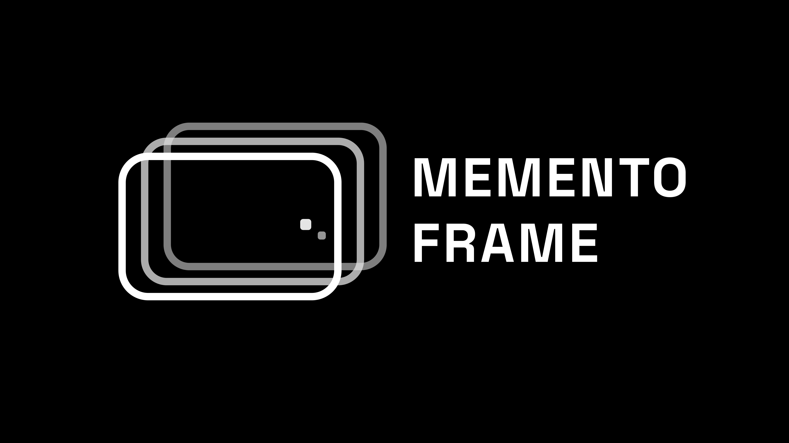

<p align="center">
  
</p>

<h1 align="center">MementoFrame</h1>

<p align="center">
  A Raspberry Pi smart photo frame built into a store-bought wooden frame with a custom 3D-printed back.<br/>
  Displays a rotating slideshow of your photos alongside a live clock, calendar, weather, and Spotify playback.
</p>

<p align="center">
  
  
  
</p>


---

<p align="center">
  
  
</p>
---

## The Build

The frame is a standard store-bought wooden photo frame. A 3D-printed back panel houses all the electronics and includes an angled leg (like a real desk frame) with adjustable viewing positions.

**Electronics inside the back panel:**
- Raspberry Pi 3B+
- GeekPi 7" 1024×600 HDMI display
- DC barrel jack + power filter board
- DS3231 RTC module (keeps accurate time across power cycles without internet)
- 2× mini 560 Pro 5V step-down converters:
  - One powers the Raspberry Pi
  - One powers the screen — enable pin controlled by GPIO 26 for scheduled on/off

**Screen brightness control:**  
Wires are soldered to the OSC (brightness control) pins on the GeekPi screen board, connected to GPIO pins 20 and 21 on the Pi. The backend pulses these pins to step brightness up or down.

**Screen power control:**  
GPIO pin 26 drives the enable pin of the screen's step-down converter. Setting the pin LOW cuts power to the screen. A physical bypass switch wired in parallel lets you disable GPIO control during development so the screen stays always on.

**Scheduled on/off:**  
The user sets an on-time and off-time via the admin dashboard (e.g. screen off at 23:00, on at 07:00). The display service evaluates this schedule on every clock tick and toggles GPIO 26 accordingly.

---

## Software Features

- **Photo slideshow** — shuffled full-screen display with smooth cross-fade transitions and a burst animation every 36 slides
- **Dual clock** — one or two configurable clocks in any IANA timezone, with day-offset indicator (+1d / -1d)
- **Mini calendar** — auto-refreshing monthly calendar; shown at full brightness at the top of each hour
- **Live weather** — current temperature and condition via WeatherAPI, with stale-data fallback while offline
- **Spotify integration** — shows current track, album art, progress bar, and liked status; derives UI accent colour from album art
- **Dynamic accent colour** — all borders and UI highlights match the playing album art, or cycle through random pastels when idle
- **Scheduled screen power** — user-defined on/off times; GPIO 26 cuts power to the screen's step-down converter
- **Brightness control** — step up/down from the admin dashboard via GPIO pulses to the screen OSC pins
- **Wi-Fi management** — automatically switches between client mode and a fallback AP hotspot if the network drops
- **Admin dashboard** — web UI at port 5000 for photo management, clock config, weather, Wi-Fi, Spotify, and brightness
- **QR code** — always-visible QR code on the display linking to the admin dashboard on the local network
- **Panel swap** — left/right layout swaps every hour for visual variety

---

## Architecture

Two Flask services run simultaneously on the Pi, plus a background Wi-Fi daemon:

| Service | Port | Role |
|---|---|---|
| `app.py` | 5000 | Admin dashboard — photo upload/management, settings, Wi-Fi, Spotify OAuth |
| `api_service.py` | 5001 | Display frontend — serves `index.html`, JSON endpoints, SSE live-reload stream |
| `ap_mode_manager.py` | — | Background daemon — monitors Wi-Fi, switches between client and AP mode |

```
/                                   ← repo root
├── README.md
├── INSTALL.md
├── docs/
│   ├── logo.png                    # Project logo (used in README header)
│   ├── photo.jpg                   # Project photo
│   ├── wiring/                     # Wiring diagrams and reference photos
│   │   ├── wiring-diagram.png      # Full wiring diagram
│   │   └── wiring-photo.jpg        # Photo of the inside of the frame
│   └── 3d-print/                   # Preview renders/photos of printed parts
│       ├── back-panel.jpg
│       └── leg.jpg
├── 3d-print/                       ← 3D printable files
│   ├── README.md                   # Print settings and assembly notes
│   ├── back-panel.stl
│   ├── leg.stl
│   └── (other parts).stl
└── mementoframe/                   ← all application code lives here
    ├── app.py                      # Admin dashboard (port 5000)
    ├── api_service.py              # Display API service (port 5001)
    ├── ap_mode_manager.py          # Wi-Fi / AP mode daemon
    ├── start_apps.sh               # Startup script (called by systemd)
    ├── config.json                 # User settings (auto-created on first save)
    ├── .env                        # Secrets — created once manually (see setup)
    ├── resources/
    │   ├── userdata/
    │   │   ├── Photos/
    │   │   │   ├── full/           # Full-size WebP photos (max 1000px)
    │   │   │   ├── thumbs/         # Thumbnail WebP photos (max 250px)
    │   │   │   ├── photos.json     # Ordered photo list
    │   │   │   └── photos.js       # Same list as a JS global (window.photos)
    │   │   └── cache/
    │   │       └── .cache_spotify  # Spotify OAuth token (auto-created after auth)
    │   └── assets/                 # Static assets (icons, fonts)
    └── static/
        └── js/
            ├── main.js
            ├── state.js
            ├── constants.js
            ├── utils.js
            └── modules/
                ├── clock.js
                ├── config.js
                ├── layout.js
                ├── photoslideshow.js
                ├── power.js
                ├── qr.js
                ├── spotify.js
                ├── weather.js
                └── wifi.js
```

---

## GPIO Pinout

| GPIO (BCM) | Connected to | Function |
|---|---|---|
| 20 | GeekPi screen OSC pin | Brightness down |
| 21 | GeekPi screen OSC pin | Brightness up |
| 26 | Step-down converter enable pin | Screen on / off |

Pin 26 is forced HIGH (screen on) at boot via `gpio=26=op,dh` in `/boot/firmware/config.txt`, so the screen powers on even before the Python service starts.

---

## Wiring

The wiring diagram below shows how all components inside the back panel connect together.

<p align="center">
  
</p>

<p align="center">
  
</p>

### Summary

**Power path:**
- DC barrel jack → power filter board → two mini 560 Pro step-down converters (both set to 5V)
  - Converter A → Raspberry Pi (via USB or GPIO 5V/GND pins)
  - Converter B → GeekPi 7" screen (enable pin wired to GPIO 26)

**Screen on/off:**
- GPIO 26 → enable pin on screen's step-down converter
- A physical bypass switch is wired in parallel between the enable pin and VIN so the screen can be kept always on during development (bypasses GPIO control entirely)

**Screen brightness:**
- GPIO 20 → OSC brightness-down pin on GeekPi screen PCB
- GPIO 21 → OSC brightness-up pin on GeekPi screen PCB
- The backend pulses each pin LOW for ~5.5 s in 0.5 s steps to ramp brightness up or down

**RTC:**
- DS3231 module → I2C bus (SDA / SCL on GPIO 2 / 3) + 3.3V + GND

---

## 3D Print

The custom back panel replaces the original cardboard backing of the wooden frame. It is designed to fit snugly over the frame's rebate and holds all electronics in place without glue.

The leg attaches to the back panel with a friction joint and has several angle positions for adjusting the viewing tilt.

<p align="center">
  
  &nbsp;&nbsp;
  
</p>

### Files

All STL files are in the [`3d-print/`](3d-print/) folder. A `README.md` inside that folder contains recommended print settings and assembly notes.

| File | Description |
|---|---|
| `back-panel.stl` | Main back panel — houses Pi, screen, converters, RTC, and DC jack |
| `leg.stl` | Desk leg with multi-angle adjustment joint |
| *(more parts as needed)* | |

### Recommended print settings

> See [`3d-print/README.md`](3d-print/README.md) for full details.

- **Material:** PLA or PETG
- **Layer height:** 0.2 mm
- **Infill:** 20–30%
- **Supports:** required for the back panel (overhang around connector cutouts)

---

## Configuration

### `.env` — secrets (created once, manually)

`.env` holds your Spotify app credentials. It is **not auto-generated** — you create it once during setup and it persists. The weather API key and all other settings are saved automatically by the admin dashboard into `config.json`.

```env
SPOTIFY_CLIENT_ID=your_spotify_client_id
SPOTIFY_CLIENT_SECRET=your_spotify_client_secret
SPOTIFY_REDIRECT_URI=https://httpbin.org/anything
```

### `config.json` — user settings (managed by the dashboard)

```json
{
  "clock1": { "timezone": "Europe/Lisbon", "label": "Lisbon" },
  "clock2": { "enabled": true, "timezone": "Asia/Shanghai", "label": "Shanghai" },
  "weather_api_key": "your_key_here",
  "weather_region": "Porto",
  "auto_power": {
    "enabled": true,
    "off_time": "23:00",
    "on_time": "07:00"
  }
}
```

---

## Spotify Setup

Spotify app credentials must be placed in `.env` manually — the admin dashboard handles only the OAuth token step, not the app keys.

1. Go to the [Spotify Developer Dashboard](https://developer.spotify.com/dashboard) and create an app.
2. Add `https://httpbin.org/anything` as an allowed redirect URI.
3. Copy your **Client ID** and **Client Secret** into `.env`.
4. Open the admin dashboard → Spotify section → click the authorisation link.
5. After approving on Spotify's page, copy the full redirect URL from your browser.
6. Paste it into the dashboard field and submit.

The OAuth token is cached at `resources/userdata/cache/.cache_spotify` and refreshes automatically.

---

## Wi-Fi / AP Mode

`ap_mode_manager.py` runs as a daemon and manages network state automatically:

- **Client mode** (green indicator) — Pi is connected to a Wi-Fi network with internet access.
- **AP mode** (blue indicator) — No known network found; Pi creates a hotspot named `MementoFrame` at `192.168.4.1`.
  - Connect your phone or laptop to the hotspot.
  - Navigate to `http://192.168.4.1:5000` to configure Wi-Fi via the admin dashboard.
- The daemon probes for reconnection every **120 seconds** and forces a reconnect attempt after **600 seconds** of AP uptime.

---

## Development (Windows / non-Pi)

Mock servers are included for frontend development without Pi hardware or GPIO.

```bash
pip install flask flask-cors pillow python-dotenv werkzeug

python mock_app.py          # port 5000 — real photo pipeline, mocked GPIO/nmcli
python mock_api_service.py  # port 5001 — mock Spotify/weather, real SSE watcher
```

Dev toggle endpoints: `POST /dev/toggle_spotify`, `POST /dev/next_track`, `POST /dev/toggle_mode`, `GET /dev/state`.

---

## Full Install Guide

See **[INSTALL.md](INSTALL.md)** for the complete step-by-step setup on Raspberry Pi OS Lite (32-bit).

---

## License

[Creative Commons Attribution-NonCommercial 4.0 International](http://creativecommons.org/licenses/by-nc/4.0/)

---

## Author

**João Fernandes** — 2026