<p align="center">
  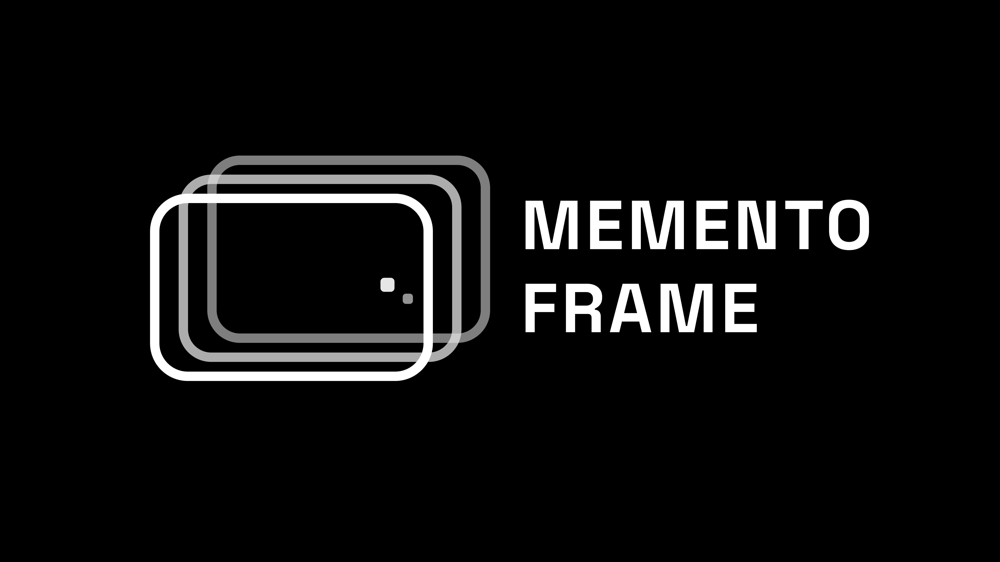
</p>

<h1 align="center">MementoFrame</h1>

<p align="center">
  Smart Raspberry Pi photo frame with automatic Wi-Fi/AP fallback, live Spotify integration, weather widgets, GPIO-controlled display power, and a web-based configuration portal.
</p>

<p align="center">
  
  
  
  
</p>

---

## Contents

- [Overview](#overview)
- [Features](#features)
- [Hardware Build](#hardware-build)
  - [Bill of Materials](#bill-of-materials)
  - [3D-Printed Parts](#3d-printed-parts)
  - [GPIO Connections](#gpio-connections)
  - [Wiring](#wiring)
  - [Enclosure Renders](#enclosure-renders)
- [Software Setup](#software-setup)
  - [Frontend Development Mocks](#frontend-development-mocks)
- [Technical Reference](#technical-reference)
- [Credits and License](#credits-and-license)

---

## Overview

MementoFrame is a self-contained smart photo frame platform built around a Raspberry Pi.

The system boots directly into a Chromium kiosk interface while remaining configurable from another device on the same network or on the fallback AP.

### Display Interface

<p align="center">
  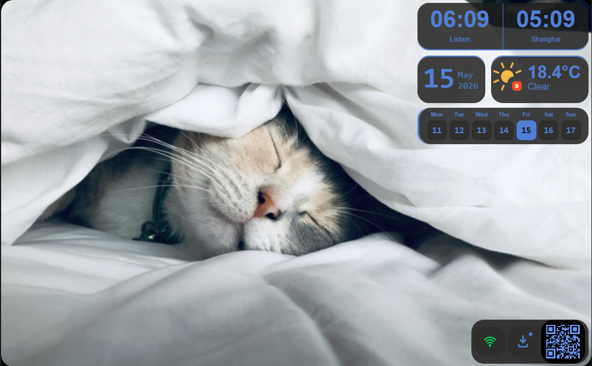
  <br/>
  <strong>Default full-frame view</strong> — photo slideshow, clocks, current weather, weekly calendar, system status, and configuration QR code.
</p>

#### Expanded Widget Layouts

<table>
  <tr>
    <td align="center">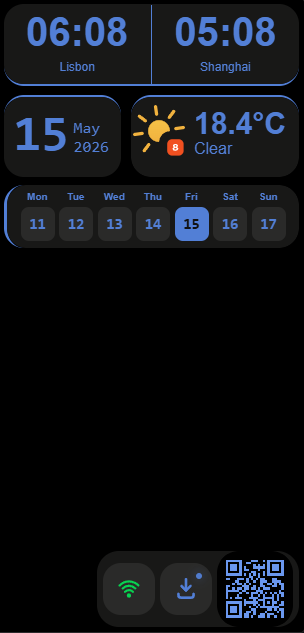<br/><strong>Default widgets</strong></td>
    <td align="center">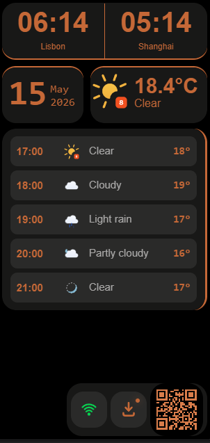<br/><strong>Five-hour forecast</strong></td>
    <td align="center">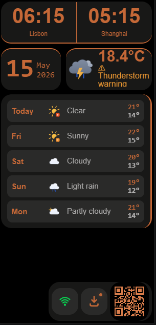<br/><strong>Five-day forecast*</strong></td>
    <td align="center">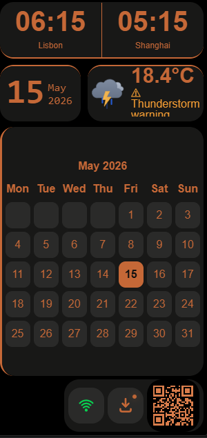<br/><strong>Large monthly calendar</strong></td>
  </tr>
</table>

*The mock environment provides five daily forecast entries for layout testing.
The current production configuration displays three days because that is the
forecast range available from its WeatherAPI.com plan.

#### Full Interface Examples

<p align="center">
  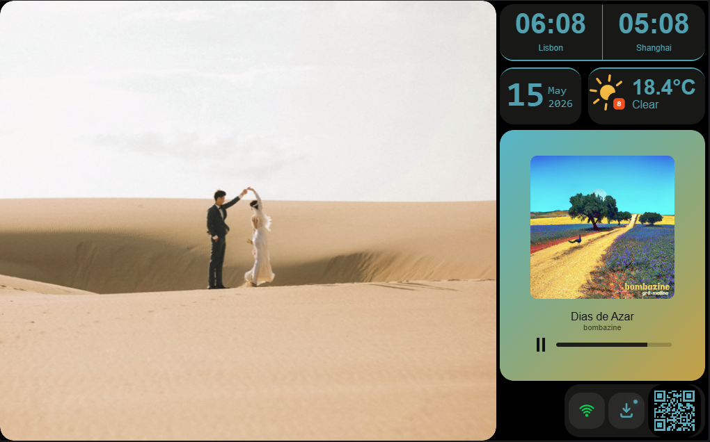
  <br/>
  <strong>Spotify-focused view</strong> — clocks, current weather, large Spotify playback, system status, and configuration QR code.
</p>

<p align="center">
  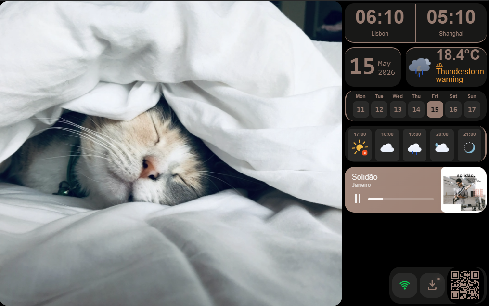
  <br/>
  <strong>Forecast and Spotify view</strong> — weather alert, weekly and hourly forecasts, compact Spotify playback, system status, and configuration QR code.
</p>

Displayed widgets and their layout depend on the saved configuration and the
data currently available from connected services.

#### Automatic Layout Modes

MementoFrame chooses layouts automatically according to Spotify playback,
forecast availability, and its current display cycle:

| State | Modes shown |
|---|---|
| Normal display | Weekly calendar by default; compact five-hour forecast once during each five-minute cycle when forecast data is available. |
| Spotify playing | Large Spotify player by default; once during each five-minute cycle it changes to compact Spotify with the weekly calendar and compact five-hour forecast. |
| Expanded mode | Starts after a 30-minute interval and remains active for up to 10 minutes. It rotates between the large five-hour forecast, large five-day forecast, and large monthly calendar; Spotify playback temporarily interrupts it. |
| Forecast unavailable | Forecast modes are skipped and the corresponding weekly or monthly calendar remains visible instead. |

The photo slideshow, clocks, date, current-weather card, network status, update
status, and configuration QR code continue to appear wherever the selected
layout has space for them. The interface also swaps sides once per hour to vary
the presentation and reduce prolonged use of the same screen area.

Interface accent colors cycle automatically through a randomized palette. When
Spotify is playing, the player derives the accent color from the current album
art and applies it across the interface for a coordinated theme.

### Project Photos

<table>
  <tr>
    <td align="center">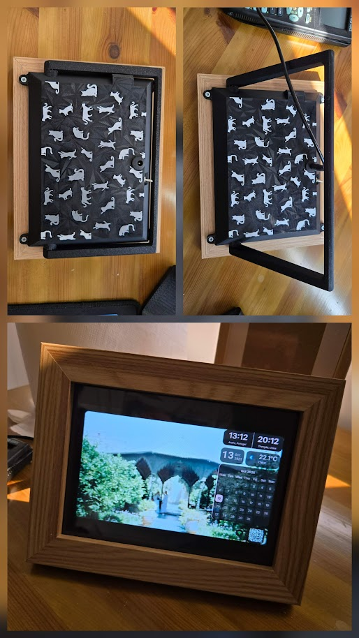<br/><strong>Front and rear overview</strong></td>
    <td align="center">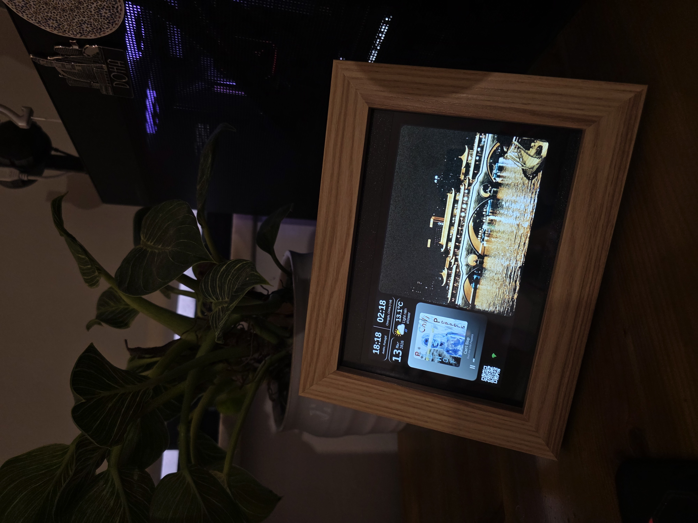<br/><strong>MementoFrame in use</strong></td>
    <td align="center">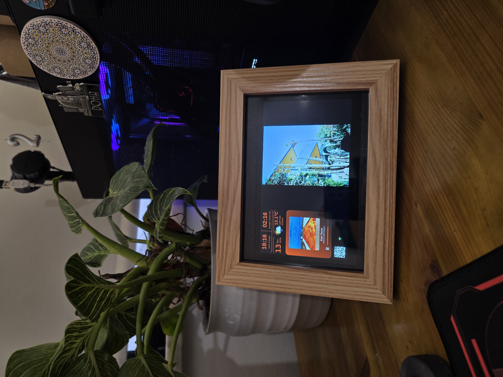<br/><strong>Portrait photo display</strong></td>
  </tr>
</table>

---

## Features

### Photo Management

- Multi-file photo uploads
- Automatic EXIF rotation handling
- Automatic WebP conversion
- Thumbnail generation
- Persistent slideshow ordering
- Dynamic display reloads via SSE

### Network Management

- Fully managed by NetworkManager
- Automatic fallback AP mode
- SSID: `MementoFrame`
- AP gateway: `192.168.4.1`
- Automatic reconnect probing
- Runtime-only configuration PIN protection

### Display Features

- Fullscreen Chromium kiosk mode
- GPIO-controlled display power
- GPIO brightness pulse control
- Auto on/off schedules
- Dual timezone clocks
- Weather widget
- Spotify album art and playback state

### Updates

- GitHub Releases-based update checks
- Manual update from the configuration portal
- Optional automatic update window
- Persistent user data preservation
- Post-reboot health validation

---

## Hardware Build

### Bill of Materials

The following frame, electronic, and display components are used for one MementoFrame.
Printed parts and their fasteners are listed separately in the next section.

| Component | Quantity | Specification / purpose |
|---|---:|---|
| Wooden photo frame | 1 | Store-bought frame for a 130 × 180 mm (13 × 18 cm, approximately 5 × 7 inch) photo. The supplied 3D files are designed around the dimensions documented below. |
| Raspberry Pi 3B+ | 1 | Main computer running the MementoFrame software. |
| EP-0170 display | 1 | Commonly sold as the GeeekPi 7-inch Raspberry Pi LCD; 1024 × 600 IPS panel. |
| DS3231 RTC module | 1 | Battery-backed real-time clock for retaining the time while disconnected from power. |
| Mini-560 DC-DC buck converter | 2 | Step-down converters configured for 12 V input and 5 V output: one for the display and one for the Raspberry Pi. |
| DC power-filter board | 1 | Filters the incoming DC supply before it reaches the converters and electronics. |
| 2.1 mm panel-mount female DC barrel jack | 1 | Panel-mount power input; select a size matching the power-supply plug. |
| Solderable Micro-USB plug | 1 | Connects the 5 V power-board output to the Raspberry Pi power input. |
| FPC HDMI cable | 1 | Low-profile HDMI connection between the Raspberry Pi and display. |
| Right-angle HDMI-to-FPC adapter | 1 | Display-side adapter. |
| HDMI-to-FPC adapter | 1 | Raspberry Pi-side adapter. |
| MTS-102 mini toggle switch | 1 | Manual power/control switch. |
| SPST DIP or slide switch | 1 (optional) | Initial-setup override that keeps the display enabled before GPIO control is active. |
| Hook-up wire | As required | Power and signal wiring between the boards, connectors, and switch. |

The two HDMI-to-FPC adapters and FPC cable must use the same pin count and
contact orientation. Before connecting the Raspberry Pi or display, adjust
both Mini-560 converters and verify a stable 5 V output with a multimeter.

### 3D-Printed Parts

MementoFrame uses six 3D-printed part designs. One complete assembly requires
one print of each design. Ready-to-print STL files are in [`hardware/stl`](hardware/stl),
and the editable Fusion 360 archive is available at
[`hardware/source/MementoFrame.f3z`](hardware/source/MementoFrame.f3z).

#### Wooden Frame Compatibility

The supplied 3D files were designed for a store-bought wooden frame intended
for a 130 × 180 mm (13 × 18 cm, approximately 5 × 7 inch) photo. A different frame can be used to suit individual
needs or preferences, but the fit must be checked and the 3D models may need to
be adjusted accordingly.

| Measurement | Reference frame |
|---|---:|
| Nominal photo size | 130 × 180 mm (13 × 18 cm / 5 × 7 inches) |
| Visible front opening | Approximately 120 × 170 mm (not important due to the display bezel) |
| Outside wooden-frame dimensions | 218 × 169 mm |
| Approximate front wooden bezel | 24.25 mm |
| Rear opening for inserting the photo/display | 130 × 181 mm |
| Approximate rear bezel | 20 mm |
| Minimum rear bezel required for back-cover mounting points | 10 mm |
| Overall frame depth | 18 mm |
| Available internal depth | 9.5 mm |
| Glass thickness | 1.6 mm |

The original glass is reused. The display sits against the glass, with the
printed assembly installed behind it. The original back is discarted.

> **Wall-mounting limitation:** The current design is intended for use with
> the printed stand. It cannot sit flush against a wall because the DC barrel
> jack protrudes from the rear. Wall mounting requires changes to the 3D files
> to relocate or recess the power connector and provide suitable mounting
> points.

#### Assembly Layout

<p align="center">
  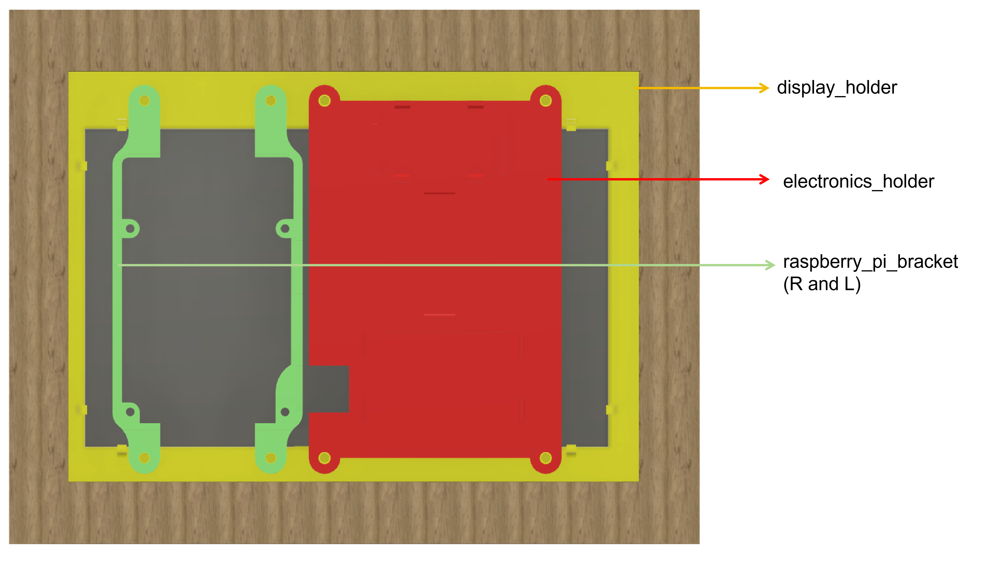
  <br/>
  <strong>Internal mounting layout</strong> — display holder, electronics holder, and left/right Raspberry Pi brackets.
</p>

The display is secured by integrated clips on the 3D-printed display holder.
The holder uses different side offsets to compensate for the display's uneven
physical bezel and center the visible LCD area within the wooden frame opening.
Display orientation is therefore important: align the thicker and thinner
bezel edges with the corresponding sides of the holder. Before engaging all
clips or closing the frame's metal tabs, inspect the frame from the front and
confirm that the active LCD area—not the outside edge of the display board—is
centered in the visible opening.

The display holder is then retained inside the wooden frame by the frame's
original metal tabs—the same tabs normally used to hold the glass, photo, and
backing board. The display holder therefore needs no adhesive or additional
fasteners of its own.

The back cover sits over the completed electronics assembly and is secured
directly to the rear wooden bezel with four 3 × 10 mm wood screws.

The DC power-filter board, DS3231 RTC module, and both Mini-560 DC-DC buck
converters press-fit into their dedicated positions on the 3D-printed
electronics holder; they do not require separate mounting screws.
The Raspberry Pi itself does not require screws; the left and right brackets clamp the board securely in place.

<p align="center">
  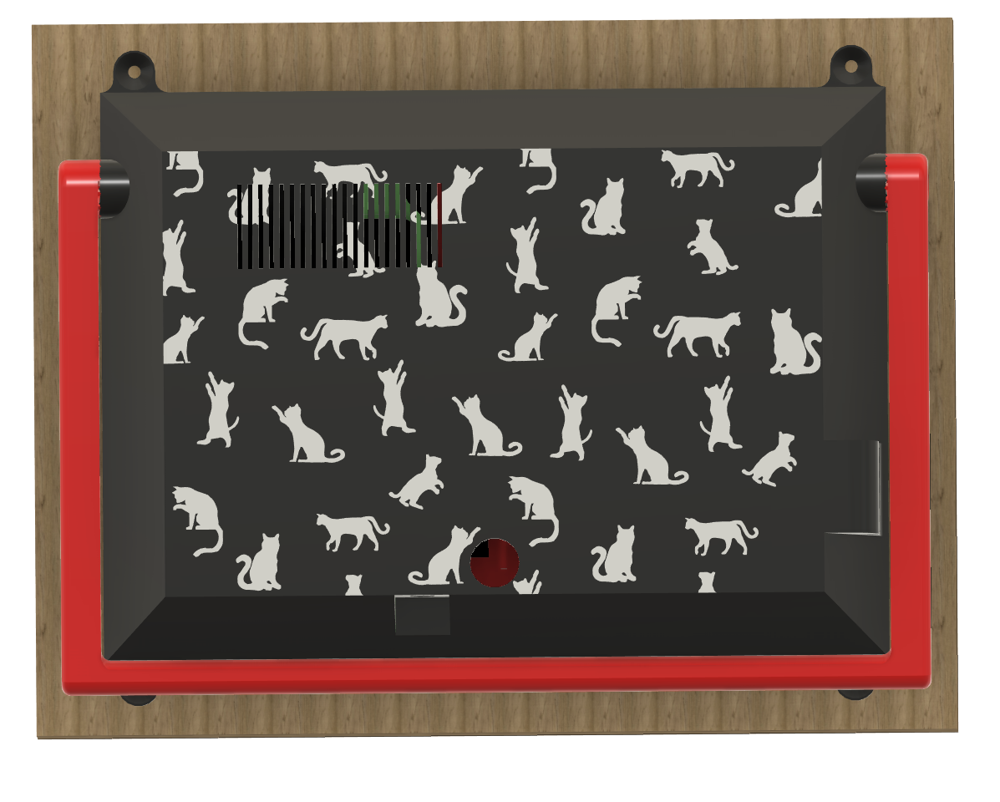
  <br/>
  <strong>Rear assembly</strong> — installed back cover and stand.
</p>

#### Assembly Hardware

In addition to the printed parts, one complete assembly requires:

| Fastener | Quantity | Used for |
|---|---:|---|
| M3 × 10 mm screws | 8 | Electronics holder and left/right Raspberry Pi brackets |
| 3 × 10 mm wood screws | 4 | Securing the back cover to the wooden frame |
| 5 × 10 mm wood screws or M5 × 10 mm screws | 2 | Attaching the stand |

Use the fastener type appropriate for the stand mounting holes and the material
the screws engage. Do not overtighten screws against the printed parts.

#### Parts to Print

| Part | STL file | Quantity | Purpose |
|---|---|---:|---|
| Display holder | [`display_holder.stl`](hardware/stl/display_holder.stl) | 1 | Holds the display with integrated clips. Its side offsets compensate for the uneven display bezel and center the visible LCD. The complete holder is retained by the wooden frame's original metal tabs. |
| Electronics holder | [`electronics_holder.stl`](hardware/stl/electronics_holder.stl) | 1 | Press-fit mounting for both DC buck converters, the power-filter board, and the RTC module; also organizes the wiring. |
| Raspberry Pi brackets | [`raspberry_pi_bracket_L.stl`](hardware/stl/raspberry_pi_bracket_L.stl) and [`raspberry_pi_bracket_R.stl`](hardware/stl/raspberry_pi_bracket_R.stl) | 1 left, 1 right | Secures the Raspberry Pi while preserving connector access and airflow. |
| Back cover | [`back_cover.stl`](hardware/stl/back_cover.stl) | 1 | Protects the electronics and wiring while providing ventilation and access openings. Secures to the wooden frame with four 3 × 10 mm wood screws. |
| Stand | [`stand.stl`](hardware/stl/stand.stl) | 1 | Supports the frame at a suitable viewing angle and attaches with two screws. |

### GPIO Connections

| GPIO | Purpose |
|---:|---|
| GPIO 20 | Brightness UP pulse |
| GPIO 21 | Brightness DOWN pulse |
| GPIO 26 | Screen power enable |

### Wiring

The diagram below shows the power distribution, display controls, RTC wiring,
and HDMI connection. The completed wiring photo can be used as a reference for
component placement and cable routing.

<p align="center">
  
  <br/>
  <strong>Wiring diagram</strong>
</p>

<p align="center">
  
  <br/>
  <strong>Completed wiring and component placement</strong>
</p>

#### Connection Summary

| Connection | Details |
|---|---|
| Power input | The 12 V supply enters through the barrel jack and MTS-102 switch, then passes through the DC power-filter board. |
| 5 V power | The filtered 12 V input feeds both Mini-560 converters. One converter powers the Raspberry Pi and the other powers the display. |
| RTC | Connect the DS3231 to Raspberry Pi 3.3 V, ground, I²C SDA, and I²C SCL. |
| Display controls | Connect display power and brightness controls to GPIO 26, GPIO 20, and GPIO 21 as labelled in the diagram. |
| Optional display-enable override | Install the optional DIP/slide switch in the display-enable circuit as shown. It keeps the display powered during initial assembly and software installation. |
| Video | The FPC HDMI cable links the Raspberry Pi HDMI output to the display HDMI input through the two HDMI-to-FPC adapters. |

#### Optional First-Boot Display Override

The display-enable GPIO starts inactive before the MementoFrame service is
installed and running, which would otherwise leave the screen switched off.
The optional DIP/slide switch provides a manual override that keeps the display
enabled while assembling the frame, installing the operating system, and
setting up the software.

Close the override switch for initial setup. Once GPIO display control is
installed and confirmed to work, open the switch to return control to the
Raspberry Pi. The switch can remain installed for future troubleshooting.

> **Important:** Disconnect power while assembling the wiring. Set and verify
> both buck-converter outputs at 5 V before connecting the Raspberry Pi or
> display, and confirm polarity with a multimeter. The display control wires
> are soldered directly to exposed PCB points, and trace locations can differ
> between display revisions. Trace them from the USB-C connector and verify the
> circuit before soldering. Never scrape, probe, or solder an energized PCB.

### Enclosure Renders

<table>
  <tr>
    <td align="center">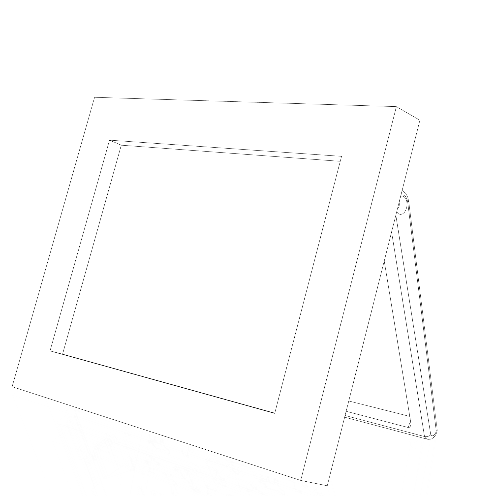<br/><strong>Front</strong></td>
    <td align="center">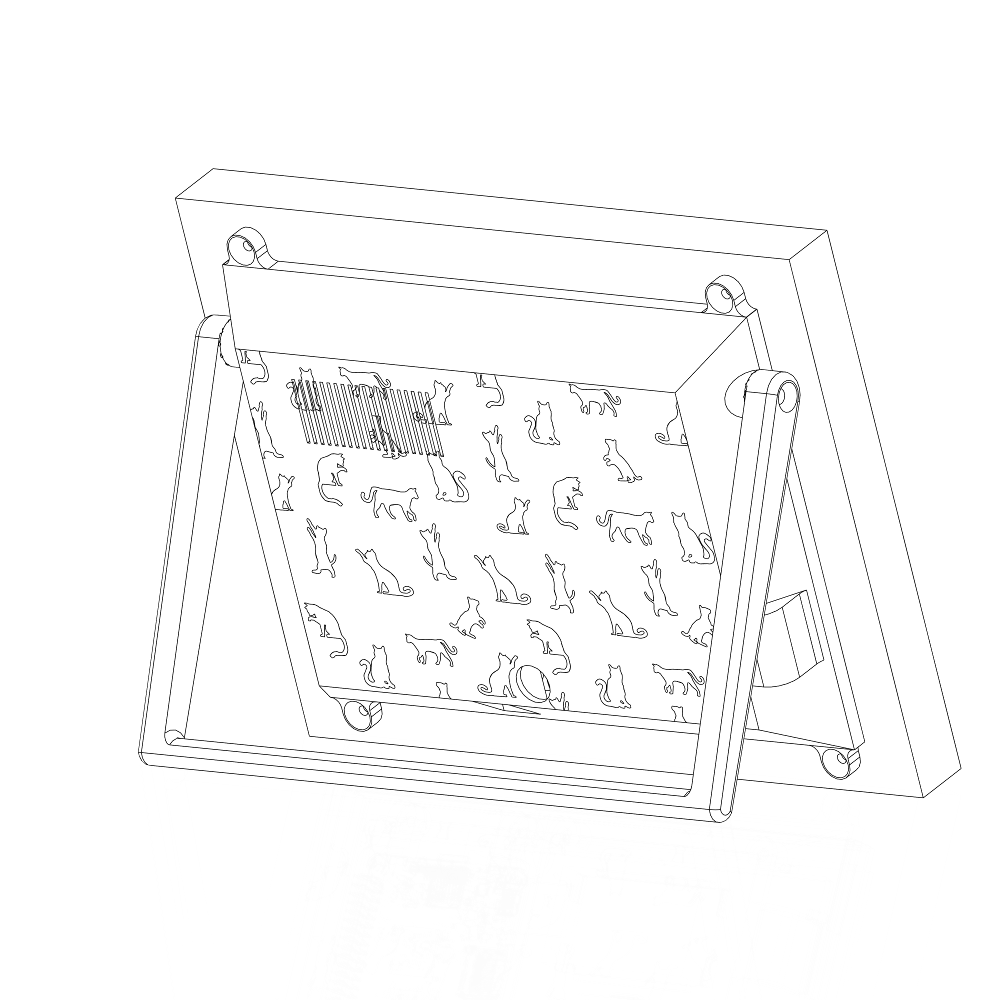<br/><strong>Back</strong></td>
    <td align="center">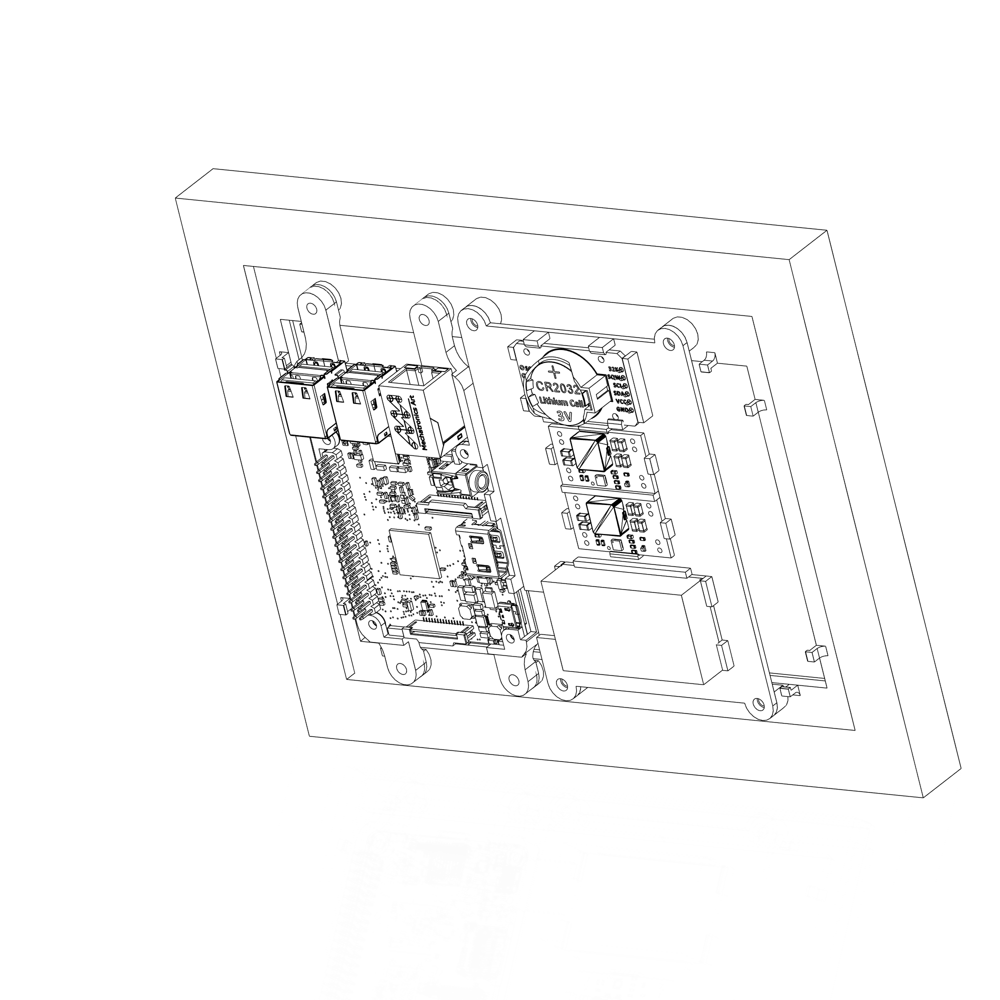<br/><strong>Back without cover</strong></td>
  </tr>
  <tr>
    <td align="center">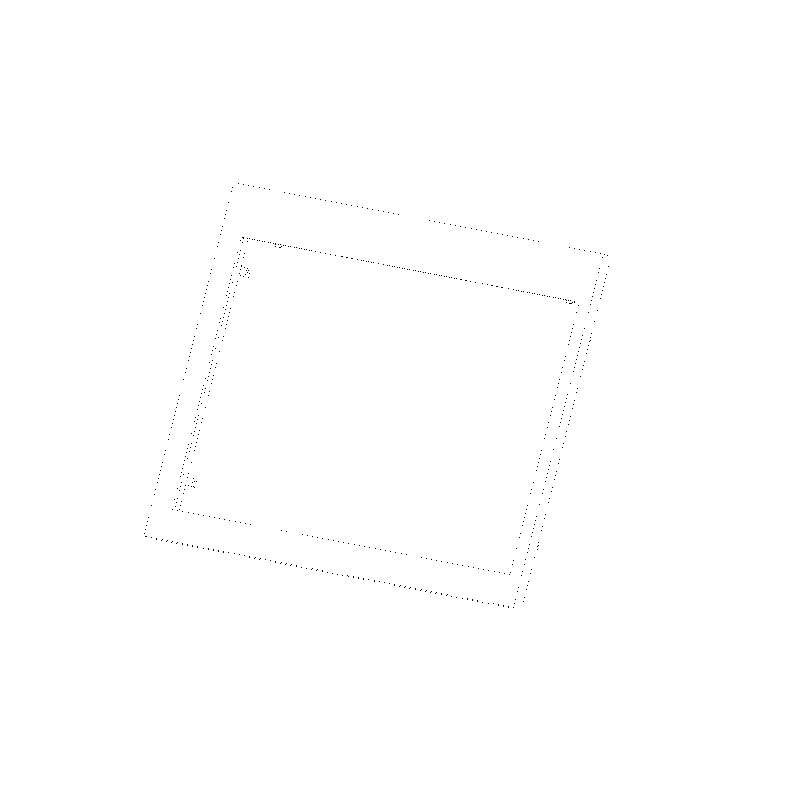<br/><strong>Display holder</strong></td>
    <td align="center">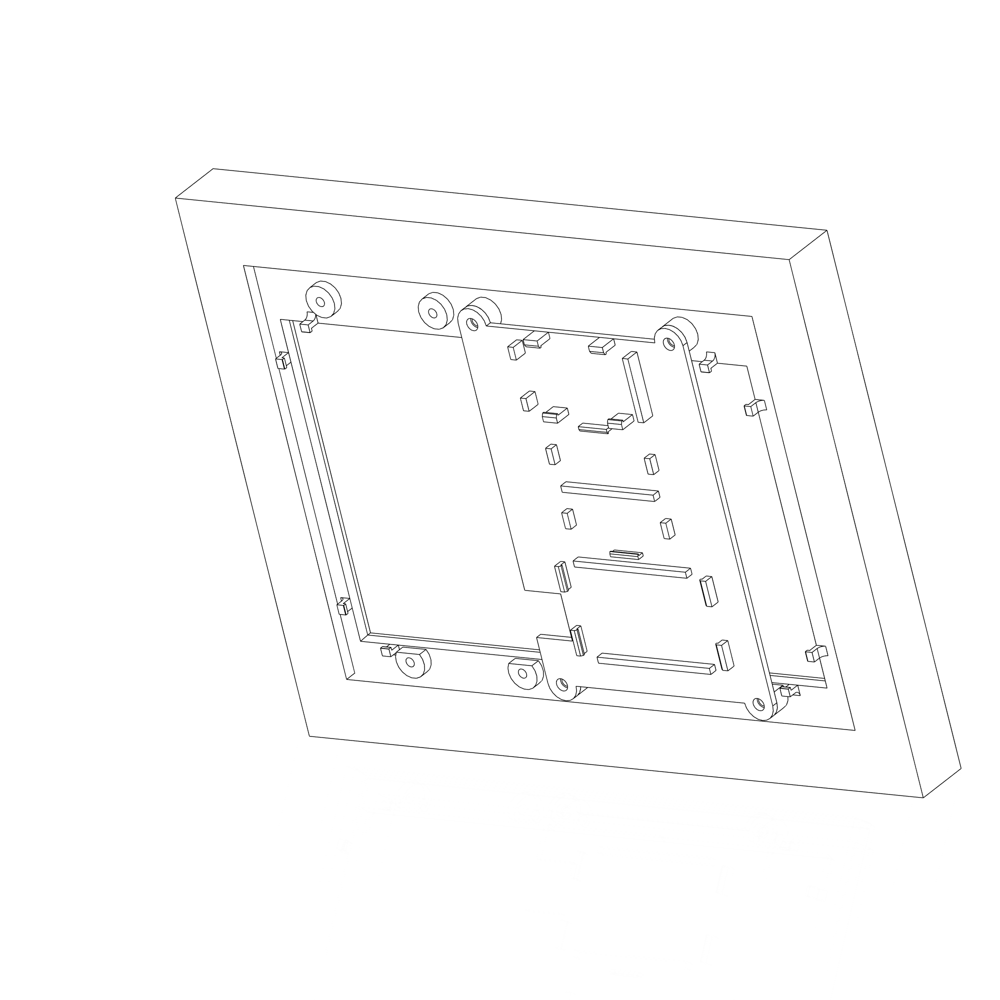<br/><strong>Middle frame</strong></td>
    <td></td>
  </tr>
</table>

---

## Software Setup

### Software Requirements

- Raspberry Pi OS Lite
- Python 3.11+
- NetworkManager
- Chromium

### Installation

Full setup instructions, configuration details, and troubleshooting guidance are available in [INSTALL.md](INSTALL.md).

Quick install:

```bash
curl -fL https://github.com/MrBroccoliJP/MementoFrame/releases/latest/download/install.sh -o install.sh
sudo bash install.sh
```

### First Connection and Fallback AP

When no known Wi-Fi network is available, MementoFrame automatically enables a local configuration hotspot.

| Setting | Value |
|---|---|
| SSID | `MementoFrame` |
| Gateway | `192.168.4.1` |
| Dashboard | `http://192.168.4.1:5000` |

#### AP Flow

```text
No Wi-Fi detected
        │
        ▼
Enable NetworkManager AP profile
        │
        ▼
Generate temporary config PIN
        │
        ▼
User connects to MementoFrame AP
        │
        ▼
Enter PIN on dashboard
        │
        ▼
Configure Wi-Fi credentials
        │
        ▼
Reconnect to client network
```

### Frontend Development Mocks

The [`dev`](dev) folder contains local mock applications for developing the
frontend and testing features on a desktop without a Raspberry Pi, GPIO
hardware, or live external services. The mocks mirror the production routes
and share state so the display and configuration portal can be tested together.

The mock environment supports:

- Display UI and configuration portal development
- Wi-Fi client and fallback AP simulation
- Configuration PIN flows
- Mock or real Spotify and weather data
- Forced-time testing for clocks and schedules
- Photo upload, deletion, and SSE reload behavior
- Screen state and software-update UI states

Run both mock services from the repository root:

```bash
python dev/run_mocks.py
```

| Interface | URL |
|---|---|
| Mock configuration portal | `http://localhost:5000` |
| Mock display UI | `http://localhost:5001` |
| Mock controls | `http://localhost:5001/mock` |

Mock update operations never install files, restart the computer, or reboot it.
Mock-only runtime state is stored under `dev/runtime/`. See
[`dev/dev_instructions.md`](dev/dev_instructions.md) for dependency setup,
available controls, test scenarios, and individual mock endpoints.

---

## Technical Reference

### Architecture

```text
                          ┌────────────────────┐
                          │ Chromium Kiosk UI  │
                          └─────────┬──────────┘
                                    │
                                    ▼
                    ┌──────────────────────────────┐
                    │ display_service.py            │
                    │ mementoframe-display.service  │
                    │ Port 5001                     │
                    └─────────┬────────────────────┘
                              │
          ┌───────────────────┼───────────────────┐
          │                   │                   │
          ▼                   ▼                   ▼
    Spotify API         WeatherAPI          GPIO screen control


                    ┌──────────────────────────────┐
                    │ config_portal_service.py      │
                    │ mementoframe-config.service   │
                    │ Port 5000                     │
                    └─────────┬────────────────────┘
                              │
                              ▼
                   Config, Wi-Fi setup, photos,
                   Spotify auth, update controls


                    ┌──────────────────────────────┐
                    │ network_manager_service.py    │
                    │ mementoframe-network.service  │
                    └─────────┬────────────────────┘
                              │
               Wi-Fi connected / fallback AP mode
```

### Runtime Services

MementoFrame uses separate services so each part can be logged, restarted, and debugged independently.

| systemd service | Runtime file | Port | Purpose |
|---|---|---:|---|
| `mementoframe-config.service` | `config_portal_service.py` | `5000` | Admin/configuration portal. |
| `mementoframe-display.service` | `display_service.py` | `5001` | Display frontend server and local widget API. |
| `mementoframe-network.service` | `network_manager_service.py` | — | Wi-Fi/AP fallback watchdog. |
| `mementoframe-kiosk.service` | Chromium | — | Fullscreen display browser. |
| `mementoframe-post-reboot.service` | `updater.py post-reboot-check` | — | Clears update pending-restart state after health checks pass. |

### Project Structure

```text
MementoFrame/
├── dev/
│   ├── dev_instructions.md
│   ├── mock_config_portal_service.py
│   ├── mock_display_service.py
│   ├── mock_shared.py
│   ├── mock_updater.py
│   └── run_mocks.py
├── docs/
│   ├── Photos/
│   ├── Renders/
│   ├── Wiring/
│   ├── Frontend_Example.png
│   ├── Frontend_Example2.png
│   ├── FrontendExample_Five-hour_forecast.png
│   ├── FrontendExample_Five-Day_Forecast.png
│   ├── FrontendExample_Large_monthly_calendar.png
│   ├── FrontendExample_Default.png
│   ├── FrontendExample_Default_big.png
│   └── logo.png
├── hardware/
│   ├── source/
│   │   └── MementoFrame.f3z
│   └── stl/
├── mementoframe/
│   ├── config_portal_service.py
│   ├── display_service.py
│   ├── network_manager_service.py
│   ├── updater.py
│   ├── version_info.py
│   ├── requirements.txt
│   ├── config.json
│   ├── runtime/
│   ├── resources/
│   │   ├── assets/
│   │   └── userdata/
│   │       ├── Photos/
│   │       └── cache/
│   ├── static/
│   └── templates/
├── INSTALL.md
└── README.md
```

### Main Endpoints

#### Config portal — port `5000`

| Endpoint | Description |
|---|---|
| `/` | Main configuration dashboard |
| `/upload` | Upload photos |
| `/delete_selected_photos` | Remove photos |
| `/save_clock_settings` | Save clock configuration |
| `/save_display_settings` | Save brightness settings |
| `/save_auto_power` | Save power schedule |
| `/save_weather_api` | Save WeatherAPI configuration |
| `/update/status` | Return updater state |
| `/update/check` | Check for updates |
| `/update/install` | Start update |
| `/spotify/connect` | Start Spotify OAuth |
| `/spotify/manual` | Finish Spotify OAuth |
| `/versions` | Return version metadata |
| `/health` | Config portal health check |

#### Display service — port `5001`

| Endpoint | Description |
|---|---|
| `/` | Render display frontend |
| `/spotify.json` | Spotify playback metadata |
| `/weather.json` | Current weather |
| `/status.json` | Network mode and IP |
| `/config/stream` | SSE reload stream |
| `/screen/on` | Enable screen GPIO |
| `/screen/off` | Disable screen GPIO |
| `/update_status.json` | Read-only update state for display UI |
| `/versions` | Return version metadata |
| `/health` | Display service health check |

### Runtime Data

| Path | Purpose |
|---|---|
| `resources/userdata/Photos/full/` | Full-size converted photos |
| `resources/userdata/Photos/thumbs/` | Generated thumbnails |
| `resources/userdata/cache/.cache_spotify` | Spotify OAuth cache |
| `runtime/config_portal_pin.json` | Temporary AP-mode PIN |
| `runtime/update_state.json` | Update lifecycle state |
| `config.json` | User configuration |
| `.env` | Local secrets and optional update token |

### Versioning

Versions are exposed through `/versions` and defined in `version_info.py`.

MementoFrame uses a composite version:

```text
release.frontend.config.display.network.updater
```

Example:

```text
v1.25.22.21.21.13
```

Meaning:

| Segment | Meaning |
|---:|---|
| `1` | Release counter |
| `25` | Frontend version |
| `22` | Config portal version |
| `21` | Display service version |
| `21` | Network manager version |
| `13` | Updater version |

The updater compares the full composite version from GitHub release tags.

### Useful Logs

```bash
journalctl -u mementoframe-config.service -f
journalctl -u mementoframe-display.service -f
journalctl -u mementoframe-network.service -f
journalctl -u mementoframe-kiosk.service -f
```

---

## Credits and License

### License

Creative Commons Attribution-NonCommercial 4.0 International

[http://creativecommons.org/licenses/by-nc/4.0/](http://creativecommons.org/licenses/by-nc/4.0/)

### Author

João Fernandes — 2026

### Acknowledgements

Special thanks to:

<table>
  <tr>
    <td align="center" width="220">
      <a href="https://meteocons.com/">
        
        <br/><strong>Meteocons</strong>
      </a>
    </td>
    <td>Weather icons used by the MementoFrame display interface.</td>
  </tr>
  <tr>
    <td align="center" width="220">
      <a href="https://www.weatherapi.com/">
        
      </a>
    </td>
    <td>Weather information displayed by MementoFrame.</td>
  </tr>
  <tr>
    <td align="center" width="220">
      <a href="https://www.spotify.com/">
        
      </a>
    </td>
    <td>Playback information, album artwork, and music integration used by the MementoFrame display interface.</td>
  </tr>
</table>

### Demo Image Attributions

These images are included only as demo/development placeholders for MementoFrame.

Images sourced from Unsplash under the Unsplash License:
https://unsplash.com/license

#### Included Images

- `erik-jan-leusink-IbPxGLgJiMI-unsplash.jpg` — Photo by Erik-Jan Leusink — https://unsplash.com/@erikjanl
- `kate-stone-matheson-uy5t-CJuIK4-unsplash.jpg` — Photo by Kate Stone Matheson — https://unsplash.com/@kstonematheson
- `ryoji-iwata-X53e51WfjIE-unsplash.jpg` — Photo by Ryoji Iwata — https://unsplash.com/@ryoji__iwata
- `ray-hennessy-MH_psben7HE-unsplash.jpg` — Photo by Ray Hennessy — https://unsplash.com/@rayhennessy
- `tanya-barrow-AobgShFe_ks-unsplash.jpg` — Photo by Tanya Barrow — https://unsplash.com/@tanyabarrow
- `bin-thieu-ILEzY3D9jbQ-unsplash.jpg` — Photo by Bin Thieu — https://unsplash.com/@binthieu
- `brooke-balentine-ta4hTTz7ipw-unsplash.jpg` — Photo by Brooke Balentine — https://unsplash.com/@brookebalentine
- `microsoft-copilot-o2MBk6J-qc-unsplash.jpg` — Photo by Microsoft 365 — https://unsplash.com/@microsoft365
- `jason-leung-TxhDR5I-sUg-unsplash.jpg` — Photo by Jason Leung — https://unsplash.com/@ninjason
