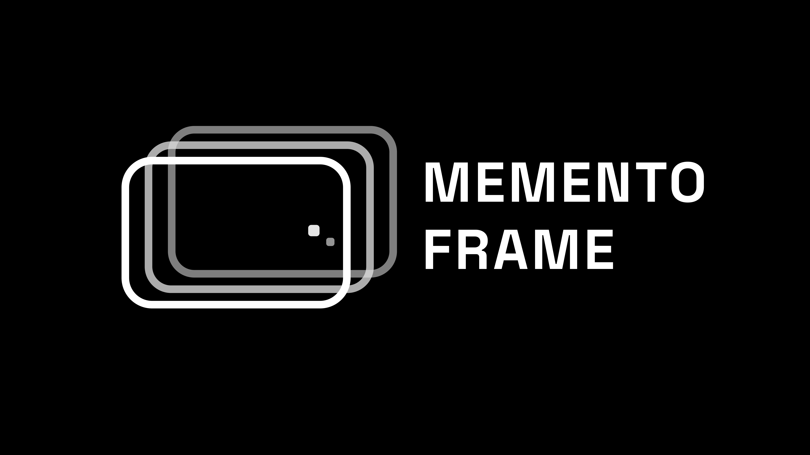
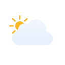

<p align="center">
  
</p>

<h1 align="center">MementoFrame</h1>

<p align="center">
  Smart Raspberry Pi photo frame with automatic Wi-Fi/AP fallback, live Spotify integration, weather widgets, GPIO-controlled display power, and a web-based configuration portal.
</p>

<p align="center">
  
  
  
  
</p>

---

## Overview

MementoFrame is a self-contained smart photo frame platform built around a Raspberry Pi.

The project combines:

- Full-screen slideshow frontend
- Local display API service
- Web-based configuration portal
- Automatic Wi-Fi ↔ AP fallback switching
- GPIO display power and brightness controls
- Spotify playback integration
- Weather and timezone widgets
- Server-Sent Events live config/photo reloading
- GitHub Release based updater

The system boots directly into a Chromium kiosk interface while remaining configurable from another device on the same network or on the fallback AP.

---

## Runtime Services

MementoFrame uses separate services so each part can be logged, restarted, and debugged independently.

| systemd service | Runtime file | Port | Purpose |
|---|---|---:|---|
| `mementoframe-config.service` | `config_portal_service.py` | `5000` | Admin/configuration portal. |
| `mementoframe-display.service` | `display_service.py` | `5001` | Display frontend server and local widget API. |
| `mementoframe-network.service` | `network_manager_service.py` | - | Wi-Fi/AP fallback watchdog. |
| `mementoframe-kiosk.service` | Chromium | - | Fullscreen display browser. |
| `mementoframe-updater.timer` | systemd timer | - | Runs periodic update checks. |
| `mementoframe-updater.service` | `updater.py autoupdate` | - | Checks and installs eligible GitHub Release updates. |

---

## Versioning

Versions are exposed through `/versions` and defined in `version_info.py`.

MementoFrame uses a composite version:

```text
release.frontend.config.display.network.updater
```

Example:

```text
v5.51.27.28.22.17
```

Meaning:

| Segment | Meaning |
|---:|---|
| `5` | Release counter |
| `51` | Frontend version |
| `27` | Config portal version |
| `28` | Display service version |
| `22` | Network manager version |
| `17` | Updater version |

The updater compares the full composite version from GitHub release tags.

---

## Architecture

```text
                          ┌────────────────────┐
                          │ Chromium Kiosk UI  │
                          └─────────┬──────────┘
                                    │
                                    ▼
                    ┌──────────────────────────────┐
                    │ display_service.py            │
                    │ mementoframe-display.service  │
                    │ Port 5001                     │
                    └─────────┬────────────────────┘
                              │
          ┌───────────────────┼───────────────────┐
          │                   │                   │
          ▼                   ▼                   ▼
    Spotify API         WeatherAPI          GPIO screen control


                    ┌──────────────────────────────┐
                    │ config_portal_service.py      │
                    │ mementoframe-config.service   │
                    │ Port 5000                     │
                    └─────────┬────────────────────┘
                              │
                              ▼
                   Config, Wi-Fi setup, photos,
                   Spotify auth, update controls


                    ┌──────────────────────────────┐
                    │ network_manager_service.py    │
                    │ mementoframe-network.service  │
                    └─────────┬────────────────────┘
                              │
               Wi-Fi connected / fallback AP mode
```

---

## Features

### Photo Management

- Multi-file photo uploads
- Automatic EXIF rotation handling
- Automatic WebP conversion
- Thumbnail generation
- Persistent slideshow ordering
- Dynamic display reloads via SSE

### Network Management

- Fully managed by NetworkManager
- Automatic fallback AP mode
- SSID: `MementoFrame`
- AP gateway: `192.168.4.1`
- Automatic reconnect probing
- Runtime-only configuration PIN protection

### Display Features

- Fullscreen Chromium kiosk mode
- GPIO-controlled display power
- GPIO brightness pulse control
- Auto on/off schedules
- Dual timezone clocks
- Weather widget
- Spotify album art and playback state

### Updates

- GitHub Release based update checks
- Manual update from the configuration portal
- Optional automatic update window
- Persistent user data preservation
- Post-reboot health validation

---

## Access Point Mode

When no known Wi-Fi network is available, MementoFrame automatically enables a local configuration hotspot.

| Setting | Value |
|---|---|
| SSID | `MementoFrame` |
| Gateway | `192.168.4.1` |
| Dashboard | `http://192.168.4.1:5000` |

### AP Flow

```text
No Wi-Fi detected
        │
        ▼
Enable NetworkManager AP profile
        │
        ▼
Generate temporary config PIN
        │
        ▼
User connects to MementoFrame AP
        │
        ▼
Enter PIN on dashboard
        │
        ▼
Configure Wi-Fi credentials
        │
        ▼
Reconnect to client network
```

---

## GPIO Usage

| GPIO | Purpose |
|---:|---|
| GPIO 20 | Brightness UP pulse |
| GPIO 21 | Brightness DOWN pulse |
| GPIO 26 | Screen power enable |

---

## Project Structure

```text
MementoFrame/
|-- README.md
|-- INSTALL.md
|-- docs/
|-- dev/
+-- mementoframe/
    |-- config_portal_service.py
    |-- display_service.py
    |-- network_manager_service.py
    |-- updater.py
    |-- version_info.py
    |-- install.sh
    |-- repair_services.sh
    |-- requirements.txt
    |-- config.json
    |-- runtime/
    |-- resources/
    |   |-- assets/
    |   +-- userdata/
    |-- static/
    +-- templates/
```

---

## Main Endpoints

### Config portal — port `5000`

| Endpoint | Description |
|---|---|
| `/` | Main configuration dashboard |
| `/upload` | Upload photos |
| `/delete_selected_photos` | Remove photos |
| `/save_clock_settings` | Save clock configuration |
| `/save_display_settings` | Save brightness settings |
| `/save_auto_power` | Save power schedule |
| `/save_weather_api` | Save WeatherAPI configuration |
| `/update/status` | Return updater state |
| `/update/check` | Check for updates |
| `/update/install` | Start update |
| `/spotify/connect` | Start Spotify OAuth |
| `/spotify/manual` | Finish Spotify OAuth |
| `/versions` | Return version metadata |
| `/health` | Config portal health check |

### Display service — port `5001` [only acessible on device]

| Endpoint | Description |
|---|---|
| `/` | Render display frontend |
| `/spotify.json` | Spotify playback metadata |
| `/weather.json` | Current weather |
| `/status.json` | Network mode and IP |
| `/config/stream` | SSE reload stream |
| `/screen/on` | Enable screen GPIO |
| `/screen/off` | Disable screen GPIO |
| `/update_status.json` | Read-only update state for display UI |
| `/versions` | Return version metadata |
| `/health` | Display service health check |

---

## Runtime Data

| Path | Purpose |
|---|---|
| `resources/userdata/Photos/full/` | Full-size converted photos |
| `resources/userdata/Photos/thumbs/` | Generated thumbnails |
| `resources/userdata/cache/.cache_spotify` | Spotify OAuth cache |
| `runtime/config_portal_pin.json` | Temporary AP-mode PIN |
| `runtime/update_state.json` | Update lifecycle state |
| `config.json` | User configuration |
| `.env` | Local secrets and optional update token |

---

## Requirements

### Hardware

- Raspberry Pi 3B+
- HDMI display [EP-0170]
- GPIO-connected brightness/display circuitry [for brighness control]
- DS3231 RTC optional

### Software

- Raspberry Pi OS Lite
- Python 3.11+
- NetworkManager
- Chromium

---

## Installation

Full setup instructions are available in:

```text
INSTALL.md
```

Quick install:

```bash
cd ~
git clone https://github.com/MrBroccoliJP/MementoFrame.git
cd MementoFrame
sudo SRC_DIR="$(pwd)" bash mementoframe/install.sh
```

---

## Useful Logs

```bash
journalctl -u mementoframe-config.service -f
journalctl -u mementoframe-display.service -f
journalctl -u mementoframe-network.service -f
journalctl -u mementoframe-kiosk.service -f
journalctl -u mementoframe-updater.service -n 80 --no-pager
```

---

## License

Creative Commons Attribution-NonCommercial 4.0 International

[http://creativecommons.org/licenses/by-nc/4.0/](http://creativecommons.org/licenses/by-nc/4.0/)

---

## Acknowledgements

MementoFrame's weather experience is made brighter by a couple of excellent weather projects.

<p align="center">
  <a href="https://meteocons.com" title="Meteocons animated weather icons">
    
  </a>
</p>

<p align="center">
  Weather icons powered by <a href="https://meteocons.com" title="Meteocons animated weather icons">Meteocons</a>
</p>

<p align="center">
  <a href="https://www.weatherapi.com/" title="Free Weather API">
    
  </a>
</p>

<p align="center">
  Powered by <a href="https://www.weatherapi.com/" title="Free Weather API">WeatherAPI.com</a>
</p>

- [Meteocons](https://meteocons.com) provides the beautiful open-source weather icon style used throughout the display widgets.
- Weather data is provided through [WeatherAPI.com](https://www.weatherapi.com/).

---

## Author

João Fernandes — 2026

---

# Demo Image Attributions

These images are included only as demo/development placeholders for MementoFrame.

Images sourced from Unsplash under the Unsplash License:
https://unsplash.com/license

## Included Images

- `erik-jan-leusink-IbPxGLgJiMI-unsplash.jpg` — Photo by Erik-Jan Leusink — https://unsplash.com/@erikjanl
- `kate-stone-matheson-uy5t-CJuIK4-unsplash.jpg` — Photo by Kate Stone Matheson — https://unsplash.com/@kstonematheson
- `ryoji-iwata-X53e51WfjIE-unsplash.jpg` — Photo by Ryoji Iwata — https://unsplash.com/@ryoji__iwata
- `ray-hennessy-MH_psben7HE-unsplash.jpg` — Photo by Ray Hennessy — https://unsplash.com/@rayhennessy
- `tanya-barrow-AobgShFe_ks-unsplash.jpg` — Photo by Tanya Barrow — https://unsplash.com/@tanyabarrow
- `bin-thieu-ILEzY3D9jbQ-unsplash.jpg` — Photo by Bin Thieu — https://unsplash.com/@binthieu
- `brooke-balentine-ta4hTTz7ipw-unsplash.jpg` — Photo by Brooke Balentine — https://unsplash.com/@brookebalentine
- `microsoft-copilot-o2MBk6J-qc-unsplash.jpg` — Photo by Microsoft 365 — https://unsplash.com/@microsoft365
- `jason-leung-TxhDR5I-sUg-unsplash.jpg` — Photo by Jason Leung — https://unsplash.com/@ninjason
